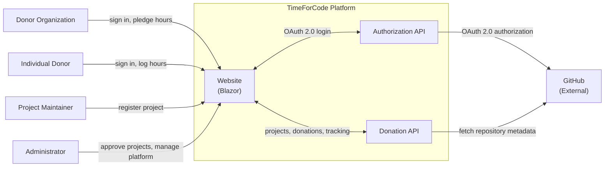
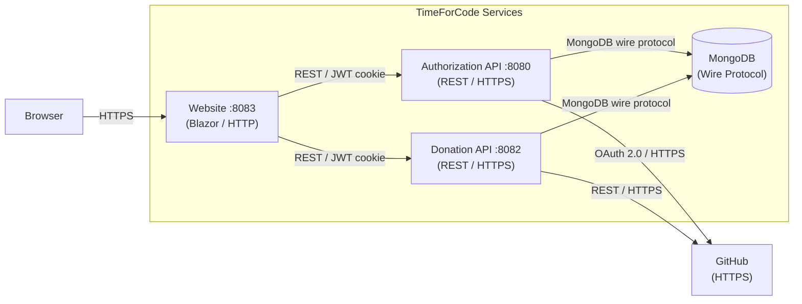

# Arc42 Section 3 — Context and Scope

Status: Mixed

This section describes the system boundary of TimeForCode and all external systems it communicates with.

---

## Business Context

TimeForCode sits between three groups of users — donor organisations, individual contributors, and project maintainers — and provides the coordination layer that connects donated time to open-source projects. It also relies on GitHub as the primary identity and project metadata provider.

### External Systems

| System | Purpose | Direction |
| --- | --- | --- |
| GitHub | OAuth 2.0 identity provider for user authentication | Authorization API calls GitHub OAuth endpoints |
| GitHub API | Source of project metadata (name, description, language, milestones) | Donation API calls GitHub REST API |

> **Current**: GitHub is the only supported identity provider. The GitHub API is designed to be called at project registration time.
>
> **Target**: Additional OAuth 2.0 providers (e.g. Google) may be added in future phases. GitHub API calls should be resilient to rate limits and provider downtime.

---

## Technical Context

The technical context shows the communication channels and protocols between components.

### Communication Protocols

| From | To | Protocol | Auth |
| --- | --- | --- | --- |
| Browser | Website | HTTPS | Session cookie (JWT) |
| Website | Authorization API | HTTPS REST | HttpOnly JWT cookie forwarded as Bearer token |
| Website | Donation API | HTTPS REST | HttpOnly JWT cookie forwarded as Bearer token |
| Authorization API | GitHub OAuth | HTTPS | Client ID + secret (server-side) |
| Donation API | GitHub REST API | HTTPS | GitHub personal access token or unauthenticated |
| Authorization API | MongoDB | MongoDB wire protocol | Username + password |
| Donation API | MongoDB | MongoDB wire protocol | Username + password |

> **Current**: Local development uses HTTP on non-standard ports. Production uses HTTPS on Azure App Service.
