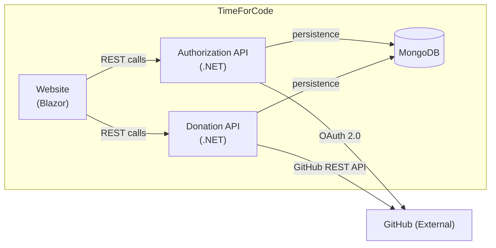
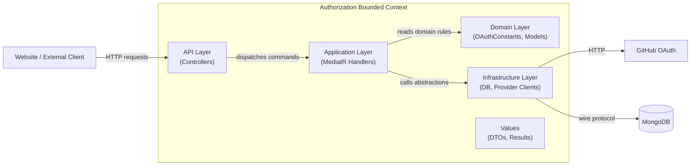
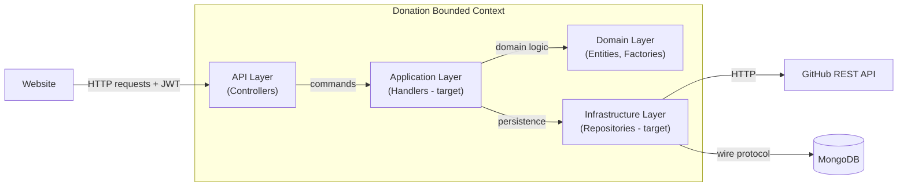

# Arc42 Section 5 — Building Block View

Status: Mixed

This section describes the static decomposition of the system into building blocks and their responsibilities.

---

## Level 1 — System Overview

At the highest level, TimeForCode consists of three deployable services and a shared data store.

---

## Level 2 — Authorization Bounded Context

The Authorization context handles all concerns related to user identity, token issuance, and session management.

### Components

| Component | Responsibility |
| --- | --- |
| `TimeForCode.Authorization.Api` | REST endpoints: login, callback, refresh, logout, user, JWKS |
| `TimeForCode.Authorization.Application` | MediatR command handlers; token service; account linking |
| `TimeForCode.Authorization.Domain` | OAuth constants and domain primitives |
| `TimeForCode.Authorization.Infrastructure` | GitHub OAuth client; MongoDB user and token repositories; RSA key loading |
| `TimeForCode.Authorization.Commands` | MediatR command and result types |
| `TimeForCode.Authorization.Values` | Shared value objects (ExternalAccessToken, TokenResult) |
| `TimeForCode.Authorization.Api.Client` | Typed HTTP client for the Website to call the Authorization API |

---

## Level 2 — Donation Bounded Context

The Donation context manages all concerns related to projects, donations, hour tracking, and organisations.

> **Current**: The domain layer is well-defined. The API layer has one stubbed endpoint. The application and infrastructure layers are not yet implemented.
>
> **Target**: Full implementation following the same pattern as the Authorization context.

### Domain Entities

| Entity | Responsibility |
| --- | --- |
| `Project` | Registered open-source project; linked to a GitHub repository |
| `Donation` | Hours pledged by an organisation or individual to a project |
| `DonationTransaction` | Single hour-log entry against an active donation |
| `DonorOrganization` | Company registered as a donor |
| `Contributor` | Developer who logs hours |
| `Maintainer` | Developer who owns a project |
| `Milestone` | Phase within a project, synced from GitHub milestones |

---

## Level 2 — Website

The Website is a Blazor application that acts as the user-facing shell. It does not contain business logic. It calls the Authorization API and the Donation API via typed HTTP clients.

| Component | Responsibility |
| --- | --- |
| `TimeForCode.Website` | Blazor pages and components |
| `TimeForCode.Authorization.Api.Client` | Typed client for Authorization API |
| `TimeForCode.Donation.Api.Client` | Typed client for Donation API |
| `TimeForCode.Shared` | CookieAuthorizationHandler; shared authorization utilities |

---

## Level 2 — Shared

| Component | Responsibility |
| --- | --- |
| `TimeForCode.Shared` | `CookieAuthorizationHandler` reads the JWT cookie and attaches it as a bearer token on outgoing HTTP calls. `AuthorizeFilter` validates the token on incoming requests. |
