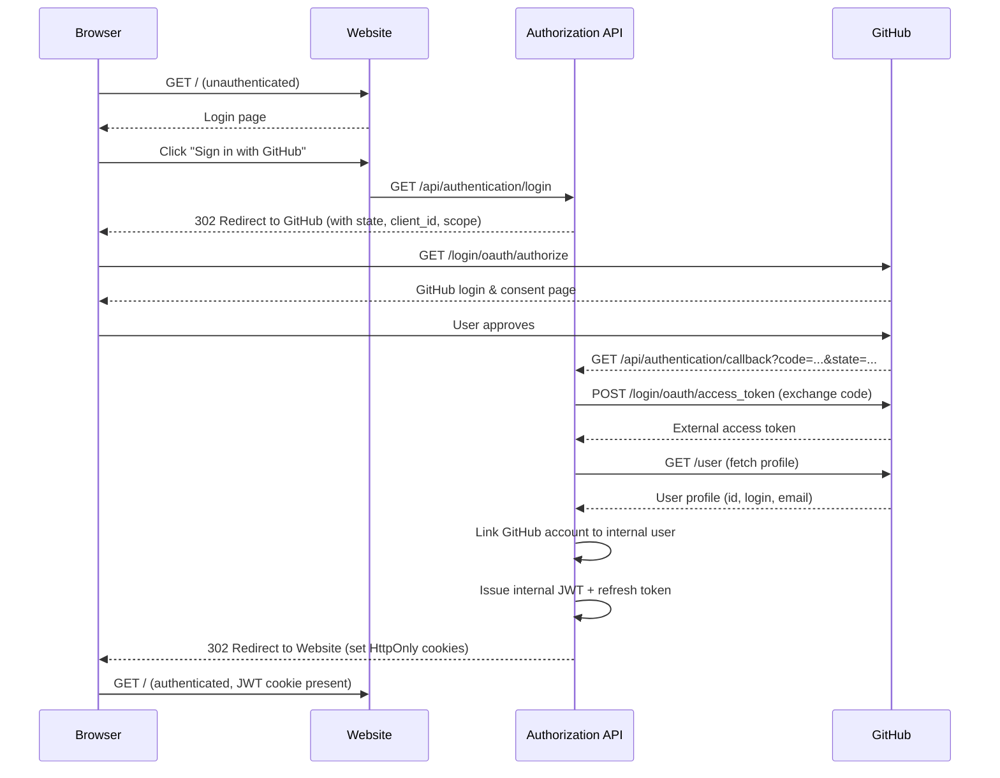
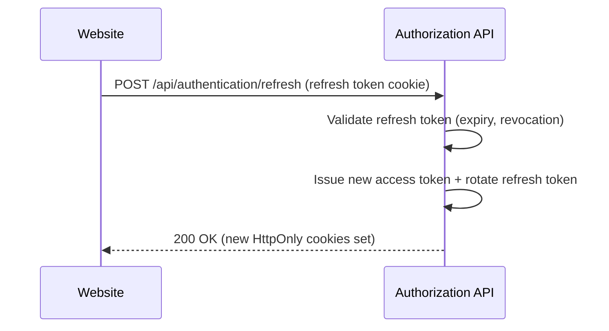
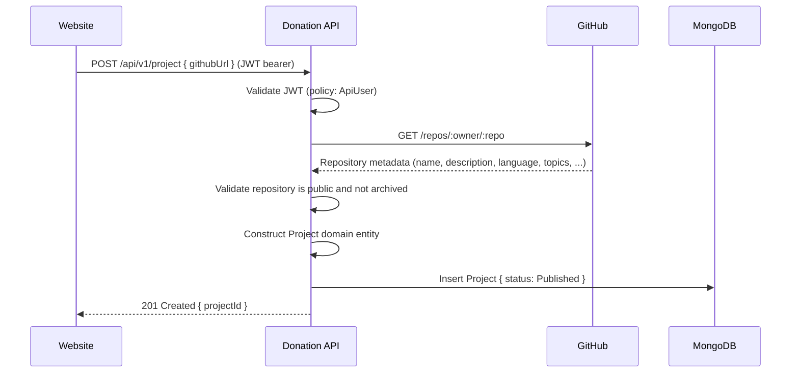
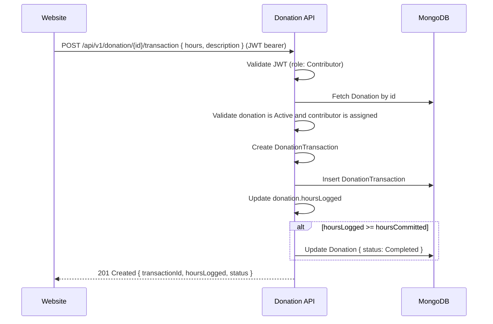

# Arc42 Section 6 — Runtime View

Status: Mixed

This section describes the most important runtime scenarios — how the building blocks interact at execution time.

---

## Scenario 1 — User Login via GitHub OAuth 2.0

This is the current, fully implemented authentication flow. See [authentication flow design](../../authentication/authentication_flow_design.md) for the complete step-by-step description.

---

## Scenario 2 — Token Refresh

When the access token expires, the Website obtains a new one transparently.

The Website does not need to re-direct the user; the `CookieAuthorizationHandler` in the Shared layer intercepts 401 responses and triggers the refresh automatically.

---

## Scenario 3 — Register a Project

---

## Scenario 4 — Log Hours Against a Donation (Target)

