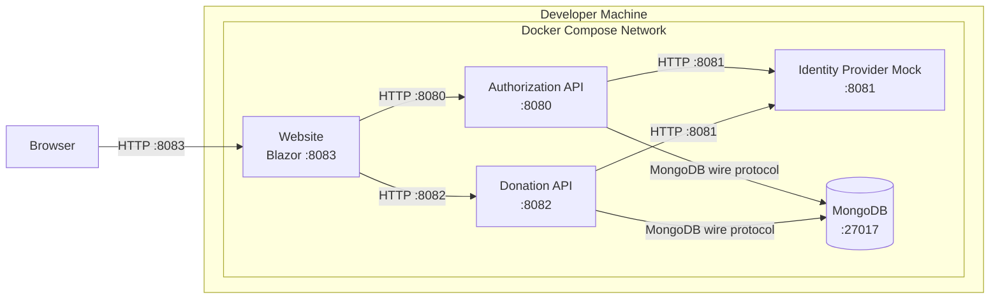
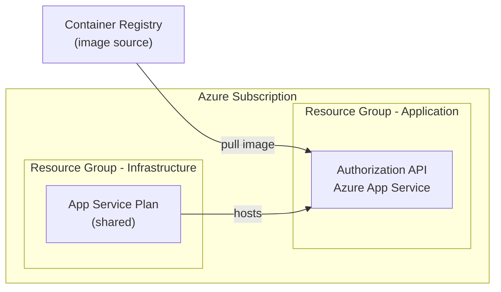
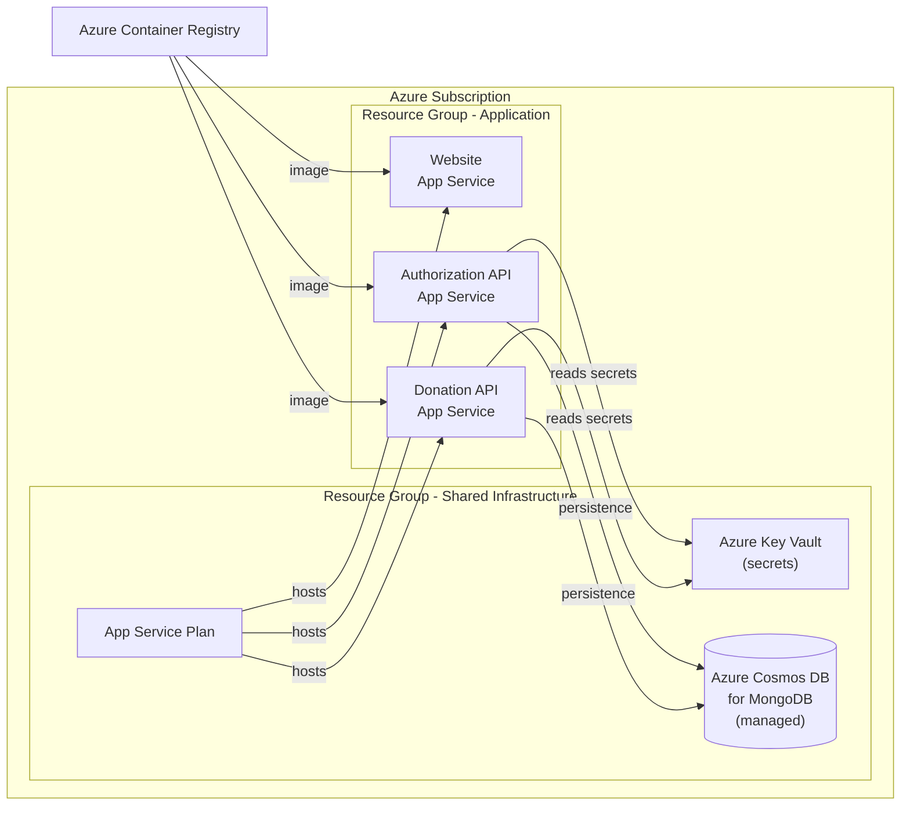

# Arc42 Section 7 - Deployment View

Status: Mixed

This section describes how the system is deployed in its target and current environments.

---

## Local Development

All services run in Docker containers orchestrated by Docker Compose. The Identity Provider Mock replaces GitHub for local OAuth flows.



To start:

```powershell
podman compose up --build
```

---

## Current Cloud Deployment (Azure)

Only the Authorization API is currently deployed to Azure. The Bicep templates in `deploy/` define the infrastructure.



> **Current**: Only the Authorization API has a Bicep definition. The Donation API and Website are not yet configured for Azure deployment.

---

## Target Cloud Deployment (Azure)

The full platform should eventually run on Azure with each service as an independent App Service container, a managed MongoDB instance, and secrets stored in Azure Key Vault.



### Target Infrastructure Requirements

| Component | Technology | Notes |
| --- | --- | --- |
| Website | Azure App Service (container) | Static assets + Blazor server |
| Authorization API | Azure App Service (container) | Current deployment extended |
| Donation API | Azure App Service (container) | Not yet deployed |
| Database | Azure Cosmos DB for MongoDB API | Drop-in replacement for MongoDB driver |
| Secrets | Azure Key Vault | Client secrets, RSA key, connection strings |
| Container registry | Azure Container Registry | Build and store images via CI/CD |
| TLS | Azure App Service managed certificates | Automatic HTTPS |

---

## Environment Summary

| Environment | Services | Notes |
| --- | --- | --- |
| Local (`docker-compose`) | All services + IdP Mock + MongoDB | Dev only; HTTP; uses mock identity provider |
| Production (Azure) | Authorization API | Only service currently deployed |
| Target Production | All services | Full deployment not yet defined in Bicep |
