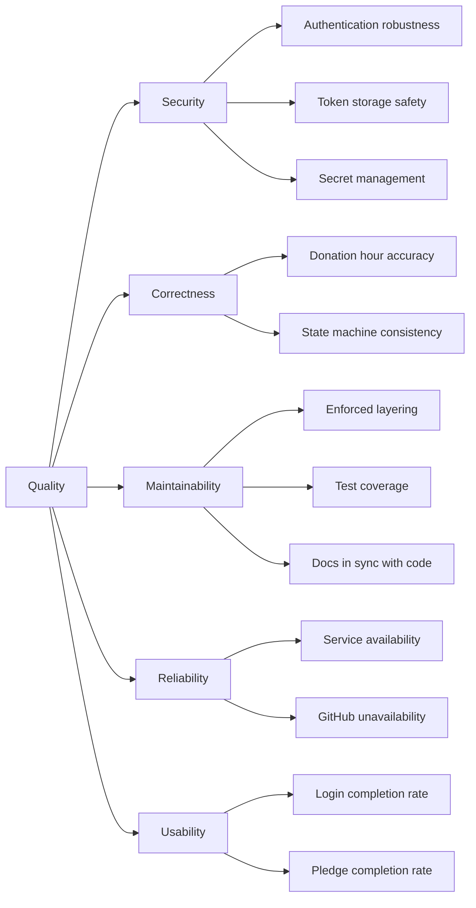

# Arc42 Section 10 — Quality Requirements

Status: Target

This section defines measurable quality scenarios that the platform must satisfy. Each scenario specifies a stimulus, the expected response, and the acceptance criterion.

---

## Quality Tree

---

## Quality Scenarios

### Security

| ID | Scenario | Stimulus | Expected Response | Acceptance Criterion |
| --- | --- | --- | --- | --- |
| SEC-Q1 | Token theft prevention | Attacker attempts to read token from browser storage | No token is stored in localStorage or sessionStorage | All tokens stored exclusively in HttpOnly cookies; confirmed by security review |
| SEC-Q2 | CSRF protection in OAuth flow | Attacker attempts to replay a stolen authorization callback | State mismatch causes the callback to be rejected with 400 | State is validated on every callback; unit test confirms rejection |
| SEC-Q3 | Expired token rejected | A request is made with a JWT that expired 1 minute ago | 401 Unauthorized returned | All API endpoints return 401 for expired tokens; verified by integration tests |
| SEC-Q4 | Wrong audience rejected | A token issued for the Donation API is presented to the Authorization API | 401 Unauthorized returned | Audience validation enforced by each service independently |
| SEC-Q5 | Secrets not in source control | A developer accidentally pushes secrets to the repository | GitHub secret scanning detects the push and alerts | GitHub secret scanning enabled; no secrets committed |

### Correctness

| ID | Scenario | Stimulus | Expected Response | Acceptance Criterion |
| --- | --- | --- | --- | --- |
| COR-Q1 | Donation hours cannot be over-logged | A contributor attempts to log 10 hours against a donation with 5 hours remaining | Request rejected with a 400 error | Business rule enforced in the Application layer; unit test confirms |
| COR-Q2 | Donation auto-completes | The last transaction brings `hoursLogged` to exactly `hoursCommitted` | Donation status transitions to Completed | Integration test confirms automatic state transition |
| COR-Q3 | Concurrent hour logging | Two contributors log hours simultaneously against the same donation | Final `hoursLogged` is the sum of both entries; no race condition | Atomic update in MongoDB; integration test with concurrent requests |

### Maintainability

| ID | Scenario | Stimulus | Expected Response | Acceptance Criterion |
| --- | --- | --- | --- | --- |
| MAINT-Q1 | Layering violation prevented | A developer adds a reference from Domain to Infrastructure | CI build fails | Architecture.Tests detect the violation and fail the build |
| MAINT-Q2 | Test coverage maintained | A new endpoint is added without tests | CI build fails quality gate | SonarCloud coverage threshold enforced on every PR |
| MAINT-Q3 | Documentation stays in sync | A new API endpoint is implemented | The endpoint appears in `docs/current/api-surface.md` before the PR is merged | PR checklist and review process enforce doc updates |

### Reliability

| ID | Scenario | Stimulus | Expected Response | Acceptance Criterion |
| --- | --- | --- | --- | --- |
| REL-Q1 | Authorization API availability | Normal operating conditions | Service available ≥ 99.5% of the time | Measured via Azure availability alerts |
| REL-Q2 | GitHub API unavailable | GitHub REST API returns 503 during project registration | Donation API returns a meaningful error; does not crash | Timeout + fallback implemented; integration test simulates GitHub failure |
| REL-Q3 | MongoDB connection lost | MongoDB becomes temporarily unreachable | API returns 503 with a retry-after hint; recovers automatically when MongoDB is available | Health check endpoint returns degraded status; service recovers on reconnection |

### Usability

| ID | Scenario | Stimulus | Expected Response | Acceptance Criterion |
| --- | --- | --- | --- | --- |
| USAB-Q1 | Login completion | A new user clicks "Sign in with GitHub" | Login completes within 5 seconds end-to-end under normal load | Measured via synthetic monitoring; p95 < 5s |
| USAB-Q2 | Donation pledge | An authenticated user completes a donation pledge form | Pledge confirmed within 3 seconds | API response time p95 < 500ms; UI feedback immediate |
