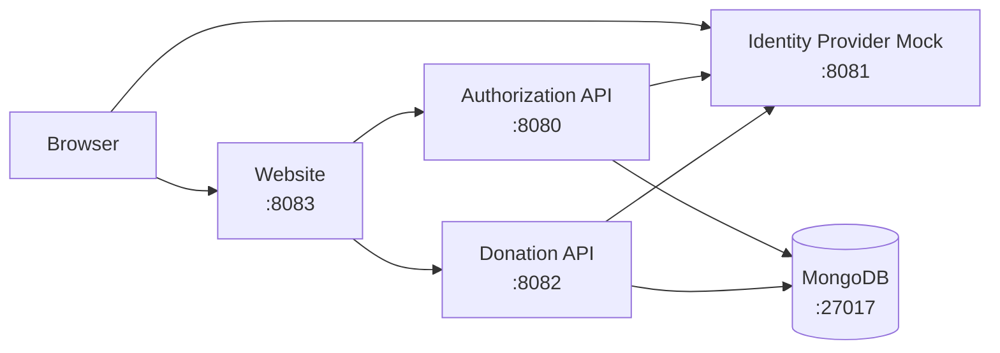

# Deployment Status

Status: Current

This document describes how the platform is deployed today, both locally and in the cloud.

---

## Local Development

The full platform runs locally via Podman and Docker Compose. The compose file at the repository root starts all services.

> **Why Podman?** Docker Desktop requires a paid licence in many organisations. Podman is a free, daemonless drop-in replacement. The `docker-compose.yaml` in this repository works with `podman compose` without modification.

**Windows first-time setup (once per machine):**

```powershell
podman machine init
podman machine start
```

**Start the stack:**

```powershell
podman compose up --build
```

**Smoke test:**

```powershell
.\scripts\smoke-test.ps1
```

### Services and Ports



The Identity Provider Mock replaces GitHub in local development. The Authorization API is configured to direct OAuth 2.0 requests to the mock instead of `github.com`. The Donation API is configured to call the mock's `/repos/{owner}/{repo}` endpoint instead of `api.github.com` when fetching repository metadata on project publish.

| Service | URL | Notes |
| --- | --- | --- |
| Website | <http://localhost:8083> | Blazor frontend |
| Authorization API | <http://localhost:8080> | OAuth 2.0 + JWT |
| Identity Provider Mock | <http://localhost:8081> | Simulates GitHub OAuth and GitHub REST API |
| Donation API | <http://localhost:8082> | Project and donation management |
| MongoDB | mongodb://localhost:27017 | Shared database instance |

### Container port note

All .NET services in this stack listen on port **8080** inside the container (not the traditional 80). This is required because the containers run as a non-root user (`appuser`) under Podman rootless mode — ports below 1024 are privileged and unavailable to non-root processes. The host-to-container port mapping in `docker-compose.yaml` still exposes the familiar ports (8080–8083) on the host machine.

| Container | Internal port | Host port |
| --- | --- | --- |
| authorization-api | 8080 | 8080 |
| identity-provider-mock | 8080 | 8081 |
| donation-api | 8080 | 8082 |
| website | 8080 | 8083 |
| mongo | 27017 | 27017 |

### Configuration

All services are configured via environment variables defined in `docker-compose.yaml`. Key configuration points:

- **Token signing**: RSA key pair provided as a base64-encoded PKCS#12 certificate via `RsaOptions__Base64Certificate`.
- **Token lifetime**: Access token expires in 60 minutes; refresh token in 7 days.
- **Redirect URIs**: The Authorization API validates redirect URIs against an allowlist.
- **Database**: Each service connects to MongoDB using a connection string from `DbOptions__ConnectionString`.

> Credentials and secrets in `docker-compose.yaml` are for local development only. Do not use them in any other environment.

---

## Cloud Deployment (Azure)

The production environment runs on Microsoft Azure using Azure App Service with container-based deployment.

### Infrastructure

```mermaid
graph LR
    subgraph Azure Subscription
        subgraph Resource Group — App
            AuthAppService["Authorization API\nApp Service"]
        end
        subgraph Resource Group — Infrastructure
            AppServicePlan["App Service Plan"]
        end
    end

    GitHub["GitHub Container Registry\nor ACR"] -->|container image| AuthAppService
    AppServicePlan --> AuthAppService
```

The infrastructure is defined as code using Azure Bicep templates in the `deploy/` folder.

| Template | Purpose |
| --- | --- |
| `deploy/application.bicep` | Top-level orchestration; references modules |
| `deploy/applicationInfrastructure.bicep` | Shared infrastructure (App Service Plan) |
| `deploy/modules/appService.bicep` | App Service definition and settings |
| `deploy/modules/appServicePlan.bicep` | App Service Plan definition |
| `deploy/modules/appServiceSidecar.bicep` | Sidecar container support |

### Deployment Region

- Primary region: West Europe.

### Known Gaps

| Gap | Notes |
| --- | --- |
| Donation API not deployed | Only the Authorization API is currently deployed to Azure |
| Website not deployed to Azure | Only runs locally |
| MongoDB managed service | Local compose uses a dev MongoDB; production database provisioning not yet defined in Bicep |
| No staging environment | Only production is defined |
| No secrets management | Secrets are passed as App Settings; Key Vault integration is not yet configured |

See [Arc42 Section 07 — Deployment View](../architecture/arc42/07-deployment-view.md) for the target deployment architecture.
