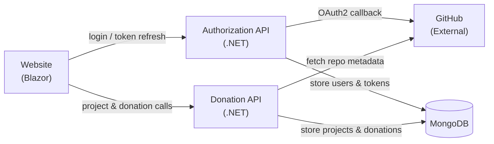

# Current Platform — Overview

Status: Current

This document describes what is implemented in the TimeForCode codebase today, organised by bounded context.

---

## Bounded Contexts

The platform is split into four bounded contexts. Each context has its own API, domain model, application layer, and infrastructure layer, following a Domain-Driven Design layering pattern.

The diagram above shows the current service topology. The Website drives authentication through the Authorization API and will drive donation operations through the Donation API once those endpoints are implemented.

---

## Authorization

The Authorization context is the most mature part of the platform.

**What is implemented:**

- GitHub OAuth 2.0 login flow with CSRF-safe `state` handling.
- Exchange of the GitHub authorization code for an external access token.
- Retrieval of GitHub user profile and linking to an internal user account.
- Issuance of an internal JWT (RS256-signed) access token and refresh token.
- Token refresh without requiring a new login.
- Secure HttpOnly cookie storage for both tokens on the browser side.
- Downstream services validate the internal JWT by checking signature, expiry, issuer, and audience.
- Identity Provider Mock service for local development and integration testing.

**Key packages and patterns:**

- MediatR for command dispatch (Login, Callback, Refresh, Logout commands).
- Domain → Application → Infrastructure → API layering.
- RSA key pair used for signing; key material is loaded from configuration.

See [authentication flow design](../authentication/authentication_flow_design.md) for the full sequence.

---

## Donation

The Donation context has a well-defined domain model, but most of the API endpoints are not yet implemented.

**What is implemented:**

- Domain entities: `Project`, `Donation`, `DonorOrganization`, `Contributor`, `Maintainer`, `DonationTransaction`, `Milestone`, `MilestoneState`.
- `GithubEntity` base class linking domain objects to GitHub repositories and users.
- Project registration endpoint (`POST /api/v1/project`): validates the GitHub URL, fetches repository metadata from GitHub, rejects private or archived repositories, and persists the project.
- Project listing endpoint (`GET /api/v1/project`): returns a paginated list of published projects; no authentication required.
- Project detail endpoint (`GET /api/v1/project/{id}`): returns full project details; no authentication required.
- Project unpublish endpoint (`DELETE /api/v1/project/{id}`): archives a project; JWT required; owner-only.
- Donation API is registered in Docker Compose and accepts JWT tokens from the Authorization API.

**What is missing:**

- Donation creation, tracking, and state transitions.
- Hour allocation and completion tracking.
- Organization and contributor management APIs.

See [capability status](capability-status.md) for the full feature-level breakdown.

---

## Website

The Website is a Blazor application that serves as the user-facing frontend.

**What is implemented:**

- Blazor project structure.
- Integration with the Authorization API client for login flows.
- Integration with the Donation API client library.

**What is missing:**

- Most UI pages and components for the donation platform features.

---

## Shared

The Shared context provides common utilities used across services.

**What is implemented:**

- `CookieAuthorizationHandler`: reads the internal JWT from the cookie and attaches it as a bearer token on outgoing requests.
- `AuthorizeFilter`: validates the JWT on incoming requests.

---

## Infrastructure

- **Storage**: MongoDB, one database per service.
- **Containerisation**: Docker Compose orchestrates all services for local development.
- **Deployment**: Azure App Service via Azure Bicep IaC templates.
- **CI/CD**: GitHub Actions with SonarCloud quality gate.

---

## Developer Setup

The recommended way to work on this project is via the **dev container** defined in `.devcontainer/devcontainer.json`.

Opening the repository in VS Code (or GitHub Codespaces) and accepting the "Reopen in Container" prompt will:

1. Provision a Debian Bookworm container with the .NET 10 SDK.
2. Install Docker-outside-of-Docker so `docker compose up` works against the host daemon.
3. Install the GitHub CLI so `gh` commands and agent skills work out of the box.
4. Install all recommended VS Code extensions (C# Dev Kit, Docker, MongoDB, markdownlint, GitHub Copilot, GitHub Copilot Chat).
5. Run `dotnet tool restore` to install local tools (`reportgenerator`, `dotnet-sonarscanner`).

Secrets and environment-specific values are **not** baked into the container. Copy `.env.real-github.example` to `.env.real-github` and fill in your credentials before running the full stack.
