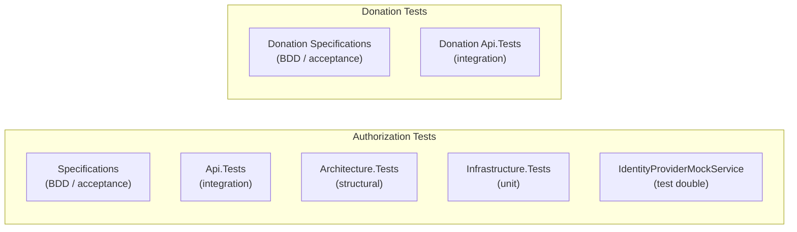

# Current Testing Strategy

Status: Current

This document describes the test projects that exist today and their scope.

---

## Test Projects

The test suite is split by bounded context and test type.



### Authorization — Specifications

**Path**: `tst/Authorization/TimeForCode.Authorization.Specifications`

BDD-style acceptance tests that describe the expected behaviour of the Authorization API from the outside. These tests cover the full authentication flow using the Identity Provider Mock as the external OAuth 2.0 provider.

### Authorization — Api.Tests

**Path**: `tst/Authorization/TimeForCode.Authorization.Api.Tests`

Integration tests that exercise the Authorization API endpoints directly.

### Authorization — Architecture.Tests

**Path**: `tst/Authorization/TimeForCode.Authorization.Architecture.Tests`

Structural tests that enforce the layering and dependency rules of the Authorization bounded context. These tests use ArchUnitNET to verify that:

- Domain projects do not reference infrastructure.
- Infrastructure does not reference the API.
- Dependencies flow in one direction only.

### Authorization — Infrastructure.Tests

**Path**: `tst/Authorization/TimeForCode.Authorization.Infrastructure.Tests`

Unit tests for the Infrastructure layer, covering data access, token storage, and external provider clients.

### Identity Provider Mock Service

**Path**: `tst/Authorization/IdentityProviderMockService`

A lightweight ASP.NET Core application that simulates a GitHub OAuth 2.0 provider. Used during local development and integration tests to avoid requiring a real GitHub OAuth application.

The mock implements:

- `/login/oauth/authorize` — simulates the GitHub authorization redirect.
- `/login/oauth/access_token` — returns a test access token.
- `GET /user` — returns a stub GitHub user profile.
- `GET /user/repos` — returns a list of stub repositories.
- `GET /repos/{owner}/{repo}` — returns repository metadata for any owner/repo combination; used by the Donation API when registering a project locally.

### Donation — Specifications

**Path**: `tst/Donation/TimeForCode.Donation.Specifications`

BDD-style acceptance tests for the Donation API. Covers the full project lifecycle: publishing a repository, browsing the project listing, and unpublishing a project. Uses a `WebApplicationFactory` with Moq and `MockHttp` to stub the MongoDB repositories and the GitHub API service.

### Donation — Api.Tests

**Path**: `tst/Donation/TimeForCode.Donation.Api.Tests`

Integration tests for the Donation API. Currently contains the Swagger snapshot test.

---

## Swagger Snapshot Tests — API Contract Gate

The `Api.Tests` project in both the Authorization and Donation bounded contexts contains a single snapshot test:

- `tst/Authorization/TimeForCode.Authorization.Api.Tests/SwaggerTests.cs`
- `tst/Donation/TimeForCode.Donation.Api.Tests/SwaggerTests.cs`

Each test reads the generated OpenAPI specification (`.json`) and uses the [Verify](https://github.com/VerifyTests/Verify) library to compare it against a committed `.verified.txt` snapshot. When the API surface changes, the test fails and writes a `.received.txt` diff file next to the snapshot.

### Purpose

This failure is **intentional and deliberate**. It is a review gate, not a test to be silenced. The intent is to force a conscious decision every time the public API contract changes.

### Review checklist

Before accepting a snapshot update, answer every question:

| # | Question | Why it matters |
| - | -------- | -------------- |
| 1 | Was this API surface change intentional, or is it a side-effect of an internal refactor? | Unintentional changes break callers silently. |
| 2 | Does the change remove or rename an existing field or endpoint? | Removals and renames are **breaking changes** for existing clients. |
| 3 | Should a new API version (e.g. `/v2/`) be introduced instead of modifying the existing one? | Breaking changes in a versioned API require a new version so existing callers are not broken. |
| 4 | If fields are added, can they be marked optional to preserve backward compatibility? | Optional new fields are non-breaking; required new fields are breaking. |
| 5 | Does the NSwag-generated client (`src/Authorization/TimeForCode.Authorization.Api.Client/`) need to be reviewed? | NSwag regenerates method names (e.g. `RepositoriesAsync` → `RepositoriesAllAsync`) when endpoints are added; callers of the generated client must be updated. |

If any answer reveals a breaking change, do not accept the snapshot silently. Decide on the appropriate response (versioning, optional fields, or explicit deprecation) before updating the snapshot.

### Accepting a snapshot update

Once the review is complete and the change is confirmed as intentional and safe:

```powershell
# Replace the committed snapshot with the newly generated one
Copy-Item `
  tst/<Module>/TimeForCode.<Module>.Api.Tests/SwaggerTests.Verify_GeneratedSwaggerFile_ShouldNotChangeUnlessIntended.received.txt `
  tst/<Module>/TimeForCode.<Module>.Api.Tests/SwaggerTests.Verify_GeneratedSwaggerFile_ShouldNotChangeUnlessIntended.verified.txt `
  -Force
```

Commit the updated `.verified.txt` alongside the code change that caused it, so the diff is reviewable in the pull request.

---

## Running Tests

```powershell
# From the repository root
dotnet test
```

All tests pass as of the current implementation state. The CI pipeline runs the full test suite on every pull request via GitHub Actions.

---

## Known Gaps

| Area | Gap |
| --- | --- |
| Donation context | No architecture tests |
| Website | No component or end-to-end tests |
| Matchmaking | No test coverage (feature not implemented) |
| Performance | No load or stress tests |
| Security | No automated penetration tests or DAST coverage |
