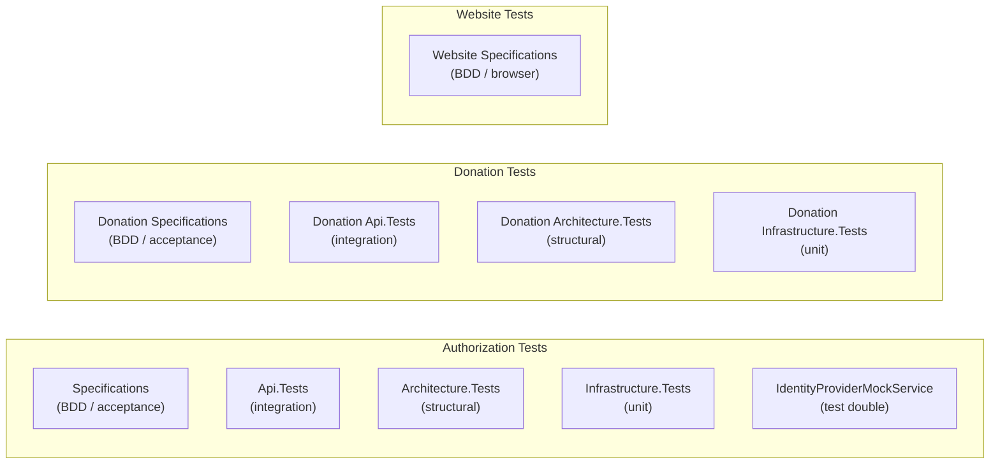

# Current Testing Strategy

Status: Current

This document describes the test projects that exist today and their scope.

---

## Test Projects

The test suite is split by bounded context and test type.



### Authorization — Specifications

**Path**: `tst/Authorization/TimeForCode.Authorization.Specifications`

BDD-style acceptance tests that describe the expected behaviour of the Authorization API from the outside. These tests cover the full authentication flow using the Identity Provider Mock as the external OAuth 2.0 provider.

### Authorization — Api.Tests

**Path**: `tst/Authorization/TimeForCode.Authorization.Api.Tests`

Integration tests that exercise the Authorization API endpoints directly.

### Authorization — Architecture.Tests

**Path**: `tst/Authorization/TimeForCode.Authorization.Architecture.Tests`

Structural tests that enforce the layering and dependency rules of the Authorization bounded context. These tests use [ArchUnitNET](https://archunitnet.readthedocs.io/) to verify that:

- Domain projects do not reference infrastructure.
- Infrastructure does not reference the API.
- Dependencies flow in one direction only.

#### Enforcement scope

All production assemblies in the Authorization bounded context are loaded before each test (via `[TestInitialize]`) in `ArchitectureTestBase`. Each rule is asserted with an `Evaluate(rule)` call that fails the test if any violation is found.

#### Example rules

```csharp
// Domain must not depend on the API layer
Types().That().Are(DomainLayer).Should()
    .NotDependOnAny(ApiLayer)
    .Because("Domain layer should not have references to other layers");

// Application must not depend on Infrastructure
Types().That().Are(ApplicationLayer).Should()
    .NotDependOnAny(InfrastructureLayer)
    .Because("Application layer should not have references to infrastructure layer");

// All MediatR request handlers must live in the Application layer
Types().That().ImplementInterface(typeof(IRequestHandler<>)).Should()
    .ResideInNamespaceMatching(".*\\.Authorization\\.Application\\..*")
    .Because("Command Handlers should always be in the application layer");
```

Adding a new rule is as simple as creating a new `[TestMethod]` in the appropriate test class (`DomainLayerTests`, `ApplicationLayerTests`, or `InfrastructureLayerTests`) and calling `Evaluate(rule)`.

### Authorization — Infrastructure.Tests

**Path**: `tst/Authorization/TimeForCode.Authorization.Infrastructure.Tests`

Unit tests for the Infrastructure layer, covering data access, token storage, and external provider clients.

### Identity Provider Mock Service

**Path**: `tst/Authorization/IdentityProviderMockService`

A lightweight ASP.NET Core application that simulates a GitHub OAuth 2.0 provider. Used during local development and integration tests to avoid requiring a real GitHub OAuth application.

The mock implements:

- `/login/oauth/authorize` — simulates the GitHub authorization redirect.
- `/login/oauth/access_token` — returns a test access token.
- `GET /user` — returns a stub GitHub user profile.
- `GET /user/repos` — returns a list of stub repositories.
- `GET /repos/{owner}/{repo}` — returns repository metadata for any owner/repo combination; used by the Donation API when registering a project locally.

### Donation — Specifications

**Path**: `tst/Donation/TimeForCode.Donation.Specifications`

BDD-style acceptance tests for the Donation API. Covers the full project lifecycle: publishing a repository, browsing the project listing, and unpublishing a project. Uses a `WebApplicationFactory` with Moq and `MockHttp` to stub the MongoDB repositories and the GitHub API service.

### Donation — Api.Tests

**Path**: `tst/Donation/TimeForCode.Donation.Api.Tests`

Integration tests for the Donation API. Currently contains the Swagger snapshot test.

### Donation — Architecture.Tests

**Path**: `tst/Donation/TimeForCode.Donation.Architecture.Tests`

Structural tests that enforce the layering and dependency rules of the Donation bounded context, mirroring the Authorization Architecture.Tests. Uses [ArchUnitNET](https://archunitnet.readthedocs.io/) to verify that:

- Domain does not reference Application, Infrastructure, or the API.
- Application does not reference Infrastructure or the API.
- Infrastructure does not reference the API.
- All classes named `*Handler` reside in the Application layer.
- All classes named `*Repository` reside in the Infrastructure layer.

### Donation — Infrastructure.Tests

**Path**: `tst/Donation/TimeForCode.Donation.Infrastructure.Tests`

Unit tests for the Donation Infrastructure layer, covering:

- `GithubRepositoryApiService` — URL parsing (invalid host, wrong segment count), successful metadata mapping, and API error responses (404, 5xx).
- `ProjectRepository` — all CRUD operations including invalid `ObjectId` handling, empty-result paths, duplicate-key exception wrapping into `RepositoryConflictException`, and `GetByGithubUrlAsync`.

### Website — Specifications

**Path**: `tst/Website/TimeForCode.Website.Specifications`

Browser-level BDD acceptance tests that drive the TimeForCode website through real user journeys using [Microsoft Playwright](https://playwright.dev/dotnet/). Tests interact only with the public HTTP/DOM surface of the running application and require the full Docker Compose stack to be up (`podman compose up --build`).

Covered journeys:

| Scenario | Description |
| --- | --- |
| Home (unauthenticated) | Visiting `/` shows the login link and the published-projects section |
| Projects list | `/projects` shows at least one project tile; each tile links to the detail page |
| Project detail | Navigating to `/projects/{id}` shows the project heading and a back link |
| Login | Clicking the login link completes the OAuth flow via the Identity Provider Mock and returns to the home page authenticated |
| Profile | `/profile` after login shows the user's GitHub login handle |
| Logout | Triggering logout returns to the home page in an unauthenticated state |

All selectors use `data-testid` attributes so they remain valid after the frontend migrates away from Blazor.

This project has **no reference** to any Blazor or Website source assembly. It is purely a browser-automation client of the running application.

#### Trace Viewer

Every scenario is recorded via Playwright tracing (screenshots, DOM snapshots, network). After a test run, one `.zip` per scenario is written to `TestResults/traces/` inside the test output directory. Open a trace with:

```powershell
pwsh tst/Website/TimeForCode.Website.Specifications/bin/Debug/net10.0/playwright.ps1 show-trace "<path-to-trace.zip>"
```

See `tst/Website/TimeForCode.Website.Specifications/README.md` for full setup and run instructions.

---

## Swagger Snapshot Tests — API Contract Gate

The `Api.Tests` project in both the Authorization and Donation bounded contexts contains a single snapshot test:

- `tst/Authorization/TimeForCode.Authorization.Api.Tests/SwaggerTests.cs`
- `tst/Donation/TimeForCode.Donation.Api.Tests/SwaggerTests.cs`

Each test reads the generated OpenAPI specification (`.json`) and uses the [Verify](https://github.com/VerifyTests/Verify) library to compare it against a committed `.verified.txt` snapshot. When the API surface changes, the test fails and writes a `.received.txt` diff file next to the snapshot.

### Purpose

This failure is **intentional and deliberate**. It is a review gate, not a test to be silenced. The intent is to force a conscious decision every time the public API contract changes.

### Review checklist

Before accepting a snapshot update, answer every question:

| # | Question | Why it matters |
| - | -------- | -------------- |
| 1 | Was this API surface change intentional, or is it a side-effect of an internal refactor? | Unintentional changes break callers silently. |
| 2 | Does the change remove or rename an existing field or endpoint? | Removals and renames are **breaking changes** for existing clients. |
| 3 | Should a new API version (e.g. `/v2/`) be introduced instead of modifying the existing one? | Breaking changes in a versioned API require a new version so existing callers are not broken. |
| 4 | If fields are added, can they be marked optional to preserve backward compatibility? | Optional new fields are non-breaking; required new fields are breaking. |
| 5 | Does the NSwag-generated client (`src/Authorization/TimeForCode.Authorization.Api.Client/`) need to be reviewed? | NSwag regenerates method names (e.g. `RepositoriesAsync` → `RepositoriesAllAsync`) when endpoints are added; callers of the generated client must be updated. |

If any answer reveals a breaking change, do not accept the snapshot silently. Decide on the appropriate response (versioning, optional fields, or explicit deprecation) before updating the snapshot.

### Accepting a snapshot update

Once the review is complete and the change is confirmed as intentional and safe:

```powershell
# Replace the committed snapshot with the newly generated one
Copy-Item `
  tst/<Module>/TimeForCode.<Module>.Api.Tests/SwaggerTests.Verify_GeneratedSwaggerFile_ShouldNotChangeUnlessIntended.received.txt `
  tst/<Module>/TimeForCode.<Module>.Api.Tests/SwaggerTests.Verify_GeneratedSwaggerFile_ShouldNotChangeUnlessIntended.verified.txt `
  -Force
```

Commit the updated `.verified.txt` alongside the code change that caused it, so the diff is reviewable in the pull request.

---

## Running Tests

```powershell
# From the repository root — excludes E2E tests that require the full Docker stack
dotnet test --filter "TestCategory!=E2E"
```

All non-E2E tests pass as of the current implementation state. The CI pipeline runs the full test suite on every pull request via GitHub Actions using the same filter.

### CI test categorisation

A single `dotnet test --filter "TestCategory!=E2E"` command is sufficient for the current test mix. Unit, integration, architecture, and BDD specification tests all complete in under 30 seconds total, so per-type filtering provides no practical triage benefit. The filter is retained only to skip Website Specifications that require a running Docker Compose stack.

Should a need arise to isolate failures by type (e.g. slow infrastructure tests blocking fast unit feedback), apply `[TestCategory("Integration")]` / `[TestCategory("Architecture")]` attributes and extend the `--filter` expression. No changes to the CI workflow files are required to support this.

### E2E tests

Website Specifications (`TimeForCode.Website.Specifications`) are categorised as E2E tests because they require the full Docker Compose stack (`podman compose up --build`). They are excluded from the standard CI filter. The recommended approach is a dedicated scheduled pipeline or a separate Docker Compose job that boots the stack before running `dotnet test --filter "TestCategory=E2E"`. This is tracked as a future improvement.

---

## Known Gaps

| Area | Gap |
| --- | --- |
| Website | No component-level tests; browser-journey coverage provided by `Website.Specifications` |
| Matchmaking | No test coverage (feature not implemented) |
| Performance | No load or stress tests |
| Security | No automated penetration tests or DAST coverage |
| E2E in CI | Website Specifications require Docker Compose; no dedicated CI job yet (see CI test categorisation section above) |
