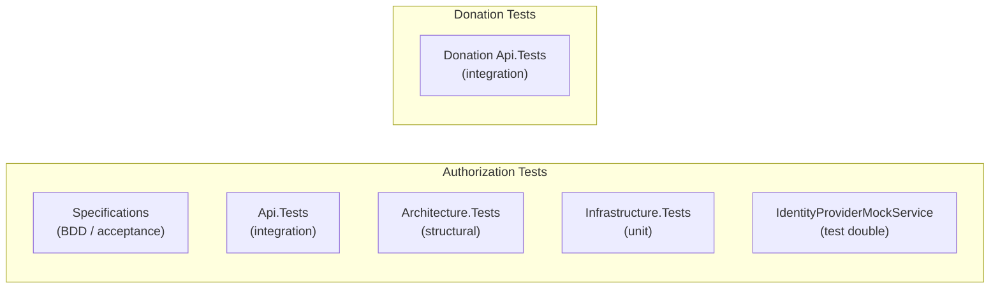

# Current Testing Strategy

Status: Current

This document describes the test projects that exist today and their scope.

---

## Test Projects

The test suite is split by bounded context and test type.



### Authorization — Specifications

**Path**: `tst/Authorization/TimeForCode.Authorization.Specifications`

BDD-style acceptance tests that describe the expected behaviour of the Authorization API from the outside. These tests cover the full authentication flow using the Identity Provider Mock as the external OAuth 2.0 provider.

### Authorization — Api.Tests

**Path**: `tst/Authorization/TimeForCode.Authorization.Api.Tests`

Integration tests that exercise the Authorization API endpoints directly.

### Authorization — Architecture.Tests

**Path**: `tst/Authorization/TimeForCode.Authorization.Architecture.Tests`

Structural tests that enforce the layering and dependency rules of the Authorization bounded context. These tests use ArchUnitNET to verify that:

- Domain projects do not reference infrastructure.
- Infrastructure does not reference the API.
- Dependencies flow in one direction only.

### Authorization — Infrastructure.Tests

**Path**: `tst/Authorization/TimeForCode.Authorization.Infrastructure.Tests`

Unit tests for the Infrastructure layer, covering data access, token storage, and external provider clients.

### Identity Provider Mock Service

**Path**: `tst/Authorization/IdentityProviderMockService`

A lightweight ASP.NET Core application that simulates a GitHub OAuth 2.0 provider. Used during local development and integration tests to avoid requiring a real GitHub OAuth application.

The mock implements:
- `/login/oauth/authorize` — simulates the GitHub authorization redirect.
- `/login/oauth/access_token` — returns a test access token.
- GitHub REST API stubs for user profile retrieval.

### Donation — Api.Tests

**Path**: `tst/Donation/TimeForCode.Donation.Api.Tests`

Integration tests for the Donation API. Currently thin, as most endpoints are not yet implemented.

---

## Running Tests

```powershell
# From the repository root
dotnet test
```

All tests pass as of the current implementation state. The CI pipeline runs the full test suite on every pull request via GitHub Actions.

---

## Known Gaps

| Area | Gap |
|---|---|
| Donation context | No architecture tests; no specification tests |
| Website | No component or end-to-end tests |
| Matchmaking | No test coverage (feature not implemented) |
| Performance | No load or stress tests |
| Security | No automated penetration tests or DAST coverage |
