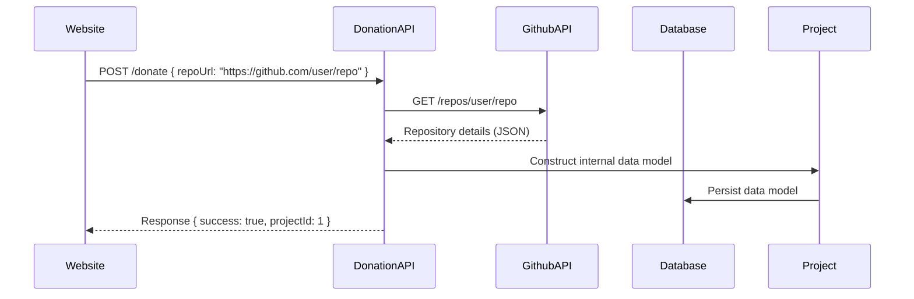

# Donation sequence diagram

## Creating/registering a project

The following sequence diagram illustrates the process of creating or registering a project for donations. It begins with a user submitting a project request through the website, which is then processed by the DonationAPI. The API interacts with GitHub to retrieve repository details, constructs an internal data model, and persists it in the database. Finally, a success response is sent back to the user.

