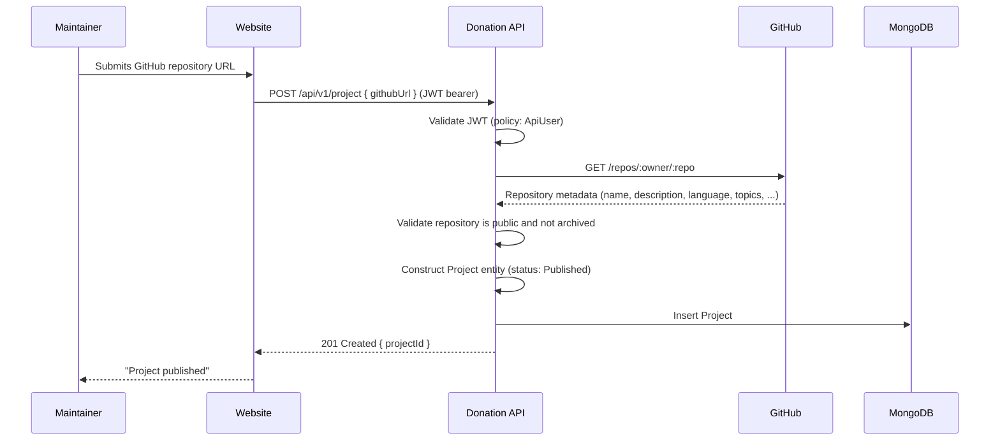
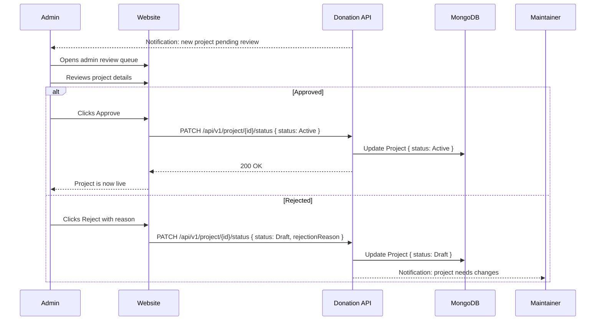
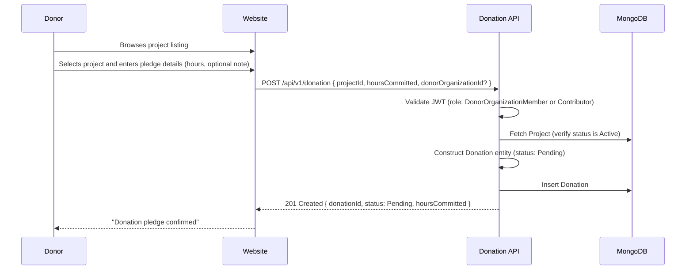
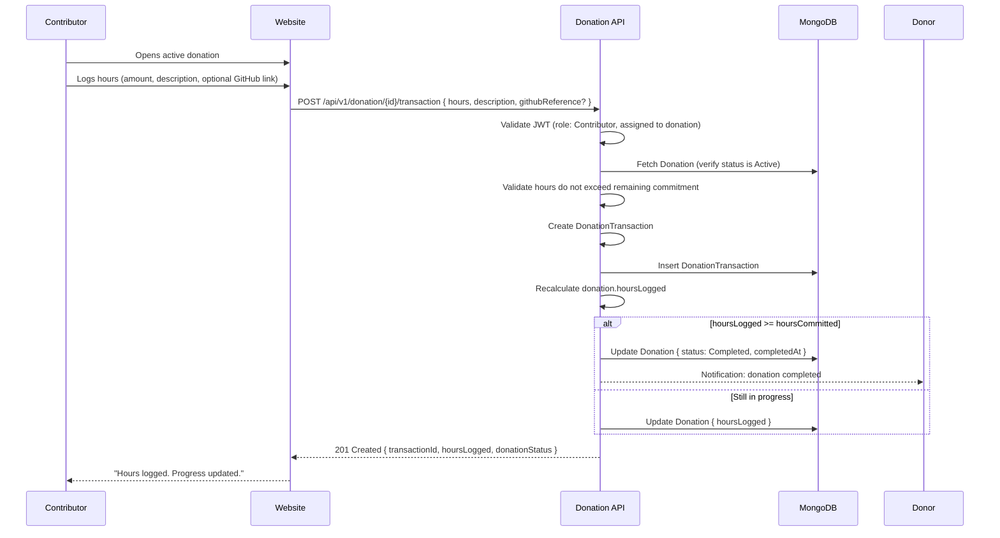
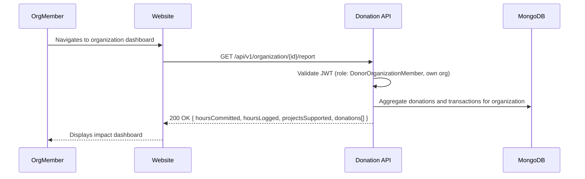
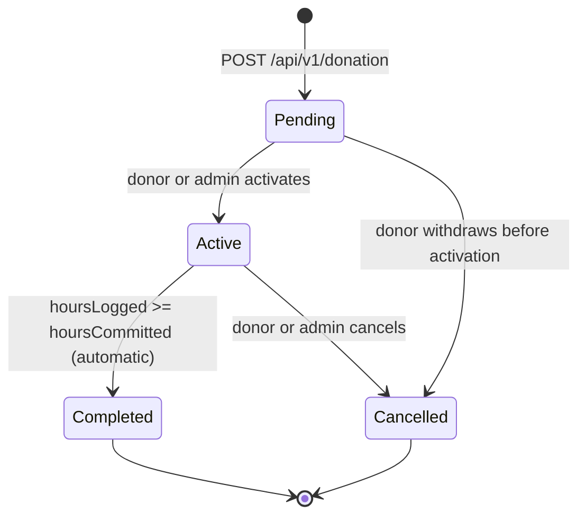

# Donation Workflows

Status: Mixed

This document describes the key workflows in the donation domain: project registration, donation lifecycle, hour tracking, and reporting. Each workflow includes a sequence diagram and explanatory text.

For the full target requirements behind these workflows, see [target/requirements.md](../target/requirements.md). For domain entity definitions, see [target/domain-model.md](../target/domain-model.md).

---

## Workflow 1 — Register a Project

A project maintainer registers an open-source project by submitting a GitHub repository URL. The platform fetches metadata from GitHub and creates a project listing immediately visible in the public project directory.

> **Current status**: Fully implemented. The `POST /api/v1/project` endpoint validates the JWT, fetches repository metadata from GitHub (or the Identity Provider Mock locally), rejects private or archived repositories, and persists the project with status `Published`.

```mermaid
sequenceDiagram
    participant Maintainer
    participant Website
    participant DonationAPI as Donation API
    participant GitHub
    participant MongoDB

    Maintainer->>Website: Submits GitHub repository URL
    Website->>DonationAPI: POST /api/v1/project { githubUrl } (JWT bearer)
    DonationAPI->>DonationAPI: Validate JWT (policy: ApiUser)
    DonationAPI->>GitHub: GET /repos/:owner/:repo
    GitHub-->>DonationAPI: Repository metadata (name, description, language, topics, ...)
    DonationAPI->>DonationAPI: Validate repository is public and not archived
    DonationAPI->>DonationAPI: Construct Project entity (status: Published)
    DonationAPI->>MongoDB: Insert Project
    DonationAPI-->>Website: 201 Created { projectId }
    Website-->>Maintainer: "Project published"
```

The project is immediately visible in the public project listing. There is no admin approval step.

**Key points**:

- The platform enriches the registration automatically from GitHub; the maintainer does not need to duplicate information.
- If the GitHub API is unavailable, the registration fails gracefully with a meaningful error — not silently create an incomplete project.
- Private or archived repositories are rejected with a 400 error.

---

## Workflow 2 — Admin Approves a Project

Once a project is submitted, a platform administrator reviews it and either approves or rejects it.

```mermaid
sequenceDiagram
    participant Admin
    participant Website
    participant DonationAPI as Donation API
    participant MongoDB

    DonationAPI-->>Admin: Notification: new project pending review
    Admin->>Website: Opens admin review queue
    Admin->>Website: Reviews project details
    alt Approved
        Admin->>Website: Clicks Approve
        Website->>DonationAPI: PATCH /api/v1/project/{id}/status { status: Active }
        DonationAPI->>MongoDB: Update Project { status: Active }
        DonationAPI-->>Website: 200 OK
        Website-->>Admin: Project is now live
    else Rejected
        Admin->>Website: Clicks Reject with reason
        Website->>DonationAPI: PATCH /api/v1/project/{id}/status { status: Draft, rejectionReason }
        DonationAPI->>MongoDB: Update Project { status: Draft }
        DonationAPI-->>Maintainer: Notification: project needs changes
    end
```

Only projects with status `Active` appear in the public project listing. Rejected projects return to `Draft` status and the maintainer is notified with a reason.

---

## Workflow 3 — Pledge Hours to a Project

An authenticated donor (organization member or individual) pledges a number of developer hours to an active project.

```mermaid
sequenceDiagram
    participant Donor
    participant Website
    participant DonationAPI as Donation API
    participant MongoDB

    Donor->>Website: Browses project listing
    Donor->>Website: Selects project and enters pledge details (hours, optional note)
    Website->>DonationAPI: POST /api/v1/donation { projectId, hoursCommitted, donorOrganizationId? }
    DonationAPI->>DonationAPI: Validate JWT (role: DonorOrganizationMember or Contributor)
    DonationAPI->>MongoDB: Fetch Project (verify status is Active)
    DonationAPI->>DonationAPI: Construct Donation entity (status: Pending)
    DonationAPI->>MongoDB: Insert Donation
    DonationAPI-->>Website: 201 Created { donationId, status: Pending, hoursCommitted }
    Website-->>Donor: "Donation pledge confirmed"
```

A new donation starts in `Pending` state. It transitions to `Active` when the donor or an admin activates it, signalling that contributors should start logging hours.

---

## Workflow 4 — Contributor Logs Hours

An assigned contributor logs time against an active donation. The platform accumulates hours and transitions the donation to `Completed` when the pledge is fulfilled.

```mermaid
sequenceDiagram
    participant Contributor
    participant Website
    participant DonationAPI as Donation API
    participant MongoDB

    Contributor->>Website: Opens active donation
    Contributor->>Website: Logs hours (amount, description, optional GitHub link)
    Website->>DonationAPI: POST /api/v1/donation/{id}/transaction { hours, description, githubReference? }
    DonationAPI->>DonationAPI: Validate JWT (role: Contributor, assigned to donation)
    DonationAPI->>MongoDB: Fetch Donation (verify status is Active)
    DonationAPI->>DonationAPI: Validate hours do not exceed remaining commitment
    DonationAPI->>DonationAPI: Create DonationTransaction
    DonationAPI->>MongoDB: Insert DonationTransaction
    DonationAPI->>DonationAPI: Recalculate donation.hoursLogged
    alt hoursLogged >= hoursCommitted
        DonationAPI->>MongoDB: Update Donation { status: Completed, completedAt }
        DonationAPI-->>Donor: Notification: donation completed
    else Still in progress
        DonationAPI->>MongoDB: Update Donation { hoursLogged }
    end
    DonationAPI-->>Website: 201 Created { transactionId, hoursLogged, donationStatus }
    Website-->>Contributor: "Hours logged. Progress updated."
```

**Key points**:

- A contributor can only log hours if they are assigned to the donation. This prevents unauthorized entries.
- Hours cannot exceed the committed total. Any attempt is rejected with a 400 error.
- The donation auto-completes when the logged total reaches the committed total.

---

## Workflow 5 — View Impact Report

A donor organization views a summary of all their contributions.

```mermaid
sequenceDiagram
    participant OrgMember
    participant Website
    participant DonationAPI as Donation API
    participant MongoDB

    OrgMember->>Website: Navigates to organization dashboard
    Website->>DonationAPI: GET /api/v1/organization/{id}/report
    DonationAPI->>DonationAPI: Validate JWT (role: DonorOrganizationMember, own org)
    DonationAPI->>MongoDB: Aggregate donations and transactions for organization
    DonationAPI-->>Website: 200 OK { hoursCommitted, hoursLogged, projectsSupported, donations[] }
    Website-->>OrgMember: Displays impact dashboard
```

The impact report aggregates data across all donations made by the organization: total hours committed, hours actually logged, number of projects supported, and a donation-by-donation breakdown.

---

## Donation Lifecycle Reference

All donation state transitions are summarised below.

```mermaid
stateDiagram-v2
    [*] --> Pending : POST /api/v1/donation
    Pending --> Active : donor or admin activates
    Pending --> Cancelled : donor withdraws before activation
    Active --> Completed : hoursLogged >= hoursCommitted (automatic)
    Active --> Cancelled : donor or admin cancels
    Completed --> [*]
    Cancelled --> [*]
```
