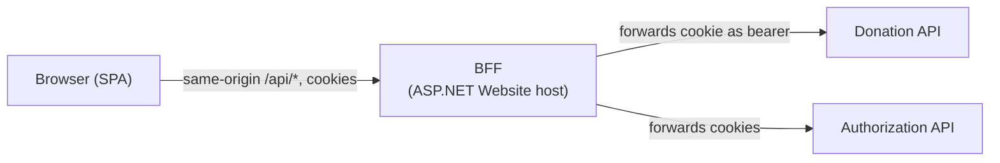

# Technical Architecture

Status: Target

This document describes how the new front-end is built and how it talks to the backend. The decision record is [ADR-012](../reference/adr/0012-react-spa-frontend.md).

---

## Stack

| Concern | Choice | Reason |
| --- | --- | --- |
| Language | TypeScript, `strict` mode | Type safety against the generated API types |
| Framework | React | Largest ecosystem for accessible component libraries and testing |
| Build tool | Vite | Fast dev server, simple configuration |
| Routing | React Router | Mature, supports route-level data loading |
| Server state | TanStack Query | Caching, retries, loading and error states for API calls |
| Forms | React Hook Form with Zod | Typed validation; map API `ProblemDetails` onto fields |
| API client | Generated from the OpenAPI snapshots | No hand-written DTOs; see below |
| Styling | CSS custom properties from [design-system.md](design-system.md), plus CSS Modules | No heavy UI framework; tokens stay the single source of truth |
| Unit and component tests | Vitest, Testing Library, axe | Fast feedback, accessibility checks included |
| E2E tests | Existing Reqnroll + Playwright suite, extended | Reuse the journeys already specified (ADR-006) |

Treat the choices as defaults. Replacing one is fine if the reason is recorded in the ADR.

## Where it lives

```text
src/
└── Frontend/
    └── TimeForCode.Frontend/        # new SPA (package.json, vite.config.ts)
        ├── src/
        │   ├── api/                 # generated clients (do not edit by hand)
        │   ├── app/                 # shell, routing, providers
        │   ├── components/          # design-system components
        │   ├── features/            # projects/, profile/, admin/, auth/
        │   ├── lib/                 # small helpers
        │   └── messages/            # all user-facing strings
        └── tests/
```

Organise by feature, not by file type. A feature folder owns its pages, queries, and tests. Shared building blocks go in `components/`.

## Authentication and the BFF

This is the most important design constraint. Read it before writing any code.

**Facts about the current backend** (verified in code):

- Login sets the access and refresh tokens as `HttpOnly`, `Secure`, `SameSite=Strict` cookies from the Authorization API.
- The cookie values are JSON documents, not bare JWTs.
- The Donation API validates only a **bearer token in the `Authorization` header**. It does not read cookies.
- Today the Blazor Website bridges the two: server-side code reads the cookie and attaches the bearer header (`CookieAuthorizationHandler`), and forwards the refresh cookie when refreshing (`RefreshTokenForwardingHandler`).
- [ADR-005](../reference/adr/0005-http-only-cookies.md) forbids tokens in JavaScript-accessible storage.

**Consequence**: a browser SPA cannot call the Donation API directly. JavaScript cannot read the HttpOnly cookie to build the bearer header, and a `SameSite=Strict` cookie will not be sent from a different site anyway.

A **BFF** (backend for frontend) is a small server that exists only to serve one front-end and sits between it and the backend APIs. An **SPA** (single-page application) is a website that loads once and then updates itself with JavaScript, fetching data from APIs.

**Decision (proposed)**: serve the SPA from, and call all APIs through, a thin **backend-for-frontend (BFF)** on the same origin. The BFF is the existing ASP.NET Website project, reduced to:

1. Serve the built SPA static files, with a fallback to `index.html` for client routes.
2. Reverse-proxy `/api/auth/*` to the Authorization API and `/api/donation/*` to the Donation API (for example with YARP), reusing the existing cookie-to-bearer and refresh-forwarding handlers.
3. Optionally render meta tags for public pages (see below).



The diagram shows that the browser only ever talks to one origin. The BFF translates cookies into bearer tokens so the backend APIs stay unchanged. Because everything is same-origin, the CORS configuration added for the admin flow is not needed for the SPA, and `SameSite=Strict` keeps working.

Alternatives considered (recorded in the ADR): changing the Donation API to accept cookies (backend change, wider CSRF surface), or hosting the SPA on a sibling subdomain with a shared cookie domain (weakens `SameSite=Strict`). Both widen the scope of this work.

### CSRF

Cookie authentication means state-changing requests need CSRF protection. `SameSite=Strict` is the first layer. Add a second: the BFF requires a custom header (for example `X-Requested-With`) on `POST`, `PUT`, `PATCH`, and `DELETE`, which the generated client always sends. Note the decision in the ADR when implemented.

### Login redirect

Login starts with a browser navigation to the Authorization API login endpoint (through the BFF), which redirects to GitHub and back. The callback sets the cookies and redirects to the SPA. The allowed redirect targets are an allow-list in the Authorization API configuration; add the new front-end origin there. Never accept an arbitrary return URL.

### Session handling in the SPA

- Determine who is signed in with `GET /api/v1/User` on app start (cache with TanStack Query).
- On a 401, the API layer tries one refresh (`POST /api/v1/Authentication/refresh`), then retries the request once. If that fails, the user is treated as signed out.
- Roles for UI decisions come from the user endpoint or token claims exposed by the BFF. The backend remains the enforcer.

## API client generation

- Source of truth: the committed OpenAPI snapshots next to each API (see [ADR-007](../reference/adr/0007-swagger-snapshot-gate.md)).
- Generate TypeScript types and a small fetch client from them with a script (`npm run generate:api`), for example with `openapi-typescript`.
- Commit the generated output, or generate in CI and fail the build if it differs. Choose one and document it here.
- When a backend change alters a snapshot, regenerate and fix the compile errors. That is the contract gate for the front-end.

## Rendering strategy

- Default: a client-rendered SPA.
- **Public pages** (`/`, `/projects`, `/projects/:id`) need good titles, descriptions, and Open Graph tags for sharing and search. The simplest start is for the BFF to inject per-route meta tags into `index.html` using the public API. Full server-side rendering or static prerendering is an upgrade if measurements show it is needed.
- **Open question**: decide when the first public page is built, and record it here.

## Configuration

- No environment-specific values in the build. The SPA uses relative `/api/...` URLs.
- Any runtime configuration (for example the repository URL for the footer) is served by the BFF as a small JSON endpoint.

## Build and deployment

- Add a Node build stage to `Dockerfile.website` that builds the SPA and copies it into the BFF image.
- Add the front-end build, lint, type-check, and unit tests to the pull request workflow. The existing workflows are in `.github/workflows/`.
- The deployment topology does not change: one Website container, now hosting the SPA. See [Deployment Status](../current/deployment-status.md).
- Pin the Node version in `.nvmrc` or `package.json` `engines`, and commit the lock file.

## Testing strategy

| Level | Tooling | Scope |
| --- | --- | --- |
| Unit | Vitest | Helpers, mapping of API errors to form errors |
| Component | Testing Library, axe | Components and pages with a mocked API layer |
| E2E | Reqnroll + Playwright (existing) | Journeys against the full stack; keep `data-testid` values |

Follow [testing-strategy](../current/testing.md) and ADR-008: E2E tests stay out of CI and run on demand.

## Security checklist

- No tokens in JavaScript-accessible storage; no tokens in URLs.
- Never render API-provided HTML. React escapes by default; do not use `dangerouslySetInnerHTML`.
- External links use `rel="noopener noreferrer"`.
- Content Security Policy set by the BFF; no inline scripts.
- Dependencies are pinned, and Dependabot or the existing dependency-update skill keeps them current.
