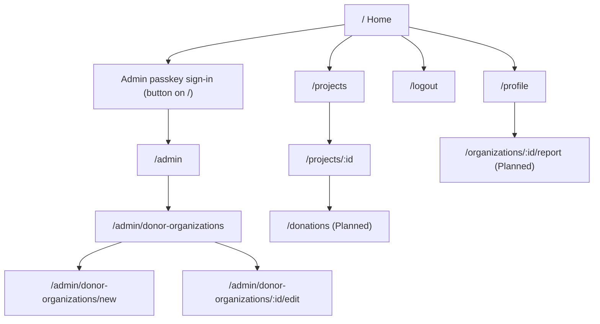

# Information Architecture

Status: Mixed

Routes marked **Exists** have a counterpart in the current Blazor Website. Routes marked **Planned** depend on backend endpoints that are not implemented yet (see [API Surface](../current/api-surface.md)) and must not be built until the API exists.

---

## Sitemap

The diagram shows navigation hierarchy, not every link. Public pages are reachable without signing in. The admin area is reachable only after the passkey ceremony.

## Route table

| Route | Page | Access | Status |
| --- | --- | --- | --- |
| `/` | Home | Public | Exists |
| `/projects` | Project list | Public | Exists |
| `/projects/:id` | Project detail | Public | Exists |
| `/profile` | Profile | Signed-in user | Exists |
| `/logout` | Sign-out | Signed-in user | Exists |
| `/admin` | Admin home | `admin` role | Exists |
| `/admin/donor-organizations` | Donor organization list | `admin` role | Exists |
| `/admin/donor-organizations/new` | Add donor organization | `admin` role | Exists |
| `/admin/donor-organizations/:id/edit` | Edit donor organization | `admin` role | Exists |
| `/projects/new` | Publish a project (maintainer) | Signed-in user | Exists in API only (`POST /api/v1/project`); no page yet |
| `/donations`, `/donations/:id` | Donations | Signed-in user | Planned |
| `/organizations/:id/report` | Impact report | Org member, admin | Planned |

The admin passkey sign-in and first-claim registration is a button on the home page in the current site, not a route. The new front-end may keep it that way or give it a dedicated route; decide when building it.

Note that the current Blazor site exposes the donor-organization screens under `/admin/...` but links to them from the main navigation for every visitor. The new front-end shows admin navigation only to the `admin` role.

## Navigation model

- **Primary navigation** (top bar, collapses to a menu on small screens): Projects, and for signed-in users Profile. A Sign-in button for anonymous users.
- **Admin navigation** (separate section, visible only for the `admin` role): Admin home, Donor organizations.
- **Footer**: link to the GitHub repository, documentation, code of conduct.
- **Breadcrumbs** on detail and edit pages only.

## Access rules in the UI

The UI hides what a user cannot do, but the backend is the authority. The UI must never be the only place an authorization rule is enforced. Roles come from the internal JWT claims; see [Authorization and Roles](../target/authorization-and-roles.md).

| State | Behaviour |
| --- | --- |
| Not signed in, page needs sign-in | Show a sign-in prompt in place, with a return to the same page after login |
| Signed in, lacks role | Show a "not allowed" message with a link home; do not redirect silently |
| Session expired | Try one silent refresh (`POST /api/v1/Authentication/refresh`); if that fails, show the sign-in prompt |
| API returns 404 | Show a "not found" page |
| API returns 5xx or network error | Show an error state with a retry action |
