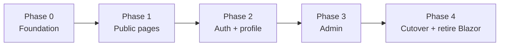

# Migration Plan

Status: Target

The Blazor Website keeps serving users until the new front-end has parity. The migration is incremental: the foundation first, then one vertical slice at a time.

---

## Strategy

Each phase is independently shippable and ends with working, tested software, in line with the principles in the [roadmap](../target/roadmap.md#principles). The new front-end can run beside the old one (different path or host) until Phase 4, so nothing breaks for users in between.

## Phases

### Phase 0 — Foundation

- Scaffold the SPA project, tooling, linting, and CI as described in [architecture](architecture.md).
- Implement design tokens, the app shell, and the core components from the [design system](design-system.md).
- Stand up the BFF: static hosting and reverse proxy for both APIs.
- Generate the API clients from the OpenAPI snapshots.
- Done when: a "hello" page is served through the BFF in Docker Compose, and CI builds and tests the SPA.

### Phase 1 — Public pages

- Home, project list, project detail, not-found and error pages.
- Meta tags for the public pages.
- Done when: the project list and detail match the current behaviour, pass axe, and the existing project E2E scenarios pass.

### Phase 2 — Sign-in and profile

- GitHub sign-in and sign-out, session handling with silent refresh, profile page, publish-a-project flow.
- Done when: the existing authentication and profile E2E scenarios pass against the new front-end.

### Phase 3 — Admin

- Admin passkey sign-in and registration (port of `webauthn-admin-interop.js`), admin home, donor organization CRUD.
- Done when: admin E2E scenarios pass, including the first-claim registration path.

### Phase 4 — Cutover

- Make the SPA the default in the Website image; remove the Blazor pages, `wwwroot/bootstrap`, and unused Blazor-only code.
- Update documentation: move the status of these documents to `Current`, update [Current Overview](../current/overview.md), the Arc42 sections listed in the ADR, and the glossary.
- Remove the temporary dual-hosting setup.

After Phase 4, new platform features (donations, contributors, reports) are built only in the new front-end, using [page-specs.md](page-specs.md).

## Parity checklist

A developer ticks an item only when it is verified in the new front-end.

- [ ] Home page, anonymous and signed-in variants
- [ ] Project list with paging
- [ ] Project detail, including unpublish for the owner
- [ ] GitHub sign-in, callback, sign-out
- [ ] New-user welcome message
- [ ] Silent token refresh
- [ ] Profile page, and the not-signed-in message
- [ ] Admin passkey sign-in
- [ ] Admin first-claim registration
- [ ] Admin home, visible only to the `admin` role
- [ ] Donor organization list, add, edit, delete
- [ ] Error and not-found pages
- [ ] All `data-testid` values preserved
- [ ] No serious or critical axe violations on any page
- [ ] Docker Compose and local start scripts (`scripts/start-local.ps1`) work with the new setup
- [ ] Production deployment tested (Bicep templates in `deploy/` updated if needed)

## What to keep, change, and remove

| Item | Action |
| --- | --- |
| Backend APIs and their OpenAPI snapshots | Keep unchanged (the allow-list for login redirects needs the new origin) |
| `TimeForCode.Website` project | Keep as the BFF host; remove Razor components at cutover |
| `CookieAuthorizationHandler`, `RefreshTokenForwardingHandler` | Keep and reuse in the BFF |
| `tst/Website/TimeForCode.Website.Specifications` | Keep; update only where the UI genuinely differs |
| `wwwroot/js/webauthn-admin-interop.js` | Port to TypeScript, then delete |
| Admin CORS policy in the Authorization API | Review at cutover; it may no longer be needed once everything is same-origin |

## Risks

| Risk | Mitigation |
| --- | --- |
| Cookie and bearer mismatch blocks direct API calls | BFF design above; validate in Phase 0 with a real authenticated call before building pages |
| Passkey Relying Party domain differs from the new origin | Configure `AdminPasskeyOptions.ServerDomain` for the new origin; test the ceremony in Phase 0 or early Phase 3 (ADR-011) |
| Scope creep into redesigning the product | Phases are parity-first; new features wait for Phase 4 |
| Planned pages built against non-existent APIs | Only build pages whose endpoints exist; see the "Planned" markers |
| Arc42 and ADR-005 text conflicts with the new stack | Update them as part of the ADR (see ADR-012 follow-up list) |
