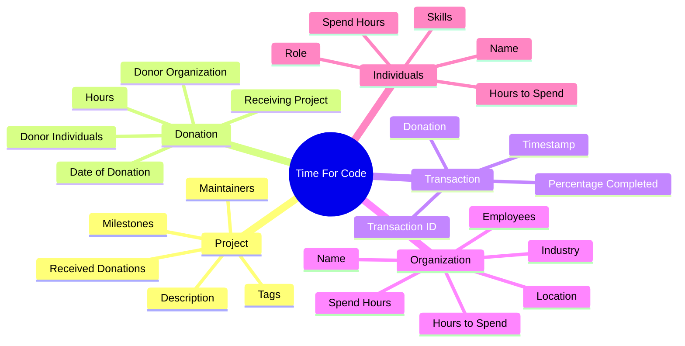

# Mindmap Domain

The following mindmap provides an overview of the Time For Code domain entities.
This diagram serves as a high-level guide to the platform's architecture
 and functionality.

```mermaid
mindmap
  root((Time For Code))
    Project
        Description
        Milestones
        Maintainers
        Received Donations
        Tags
    Donation
        Hours
        Date of Donation
        Receiving Project
        Donor Organization
        Donor Individuals
    Transaction
        Transaction ID
        Donation
        Percentage Completed
        Timestamp
    Organization
        Name
        Industry
        Location
        Employees
        Hours to Spend
        Spend Hours
    Individuals
        Name
        Role
        Skills
        Hours to Spend
        Spend Hours
```
