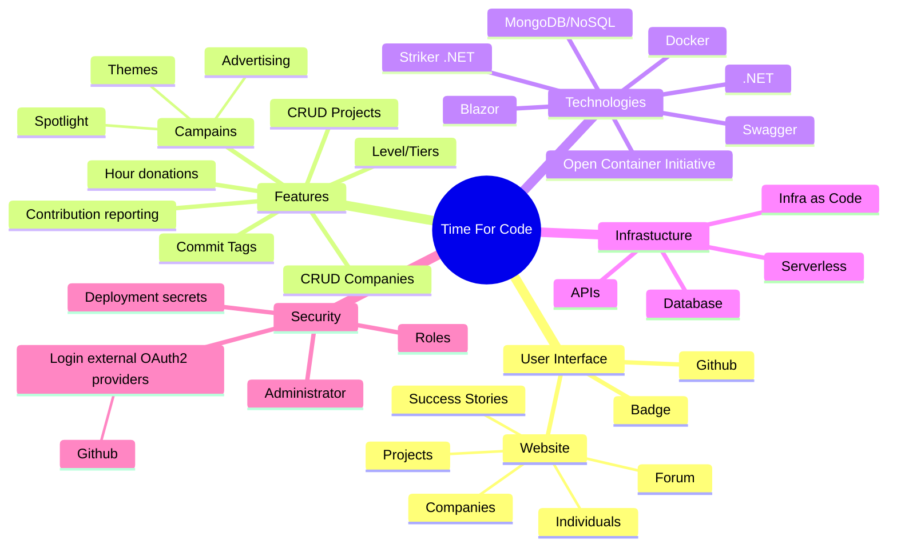

# Mindmap Time for Code

The following mind map provides an overview of the Time For Code platform. 
This diagram serves as a high-level guide to the platform's architecture and functionality.

```mermaid
mindmap
  root((Time For Code))
    User Interface
        Website
            Success Stories
            Forum
            Projects
            Companies
            Individuals
        Badge
        Github
    Features
        Hour donations
        Contribution reporting
        Level/Tiers
        Commit Tags
        Campains
            Spotlight
            Themes
            Advertising
        CRUD Projects
        CRUD Companies
    Technologies
        .NET
        Blazor
        Striker .NET
        MongoDB/NoSQL
        Docker
        Open Container Initiative
        Swagger
    Infrastucture
        Infra as Code
        Database
        Serverless
        APIs
    Security 
        Login external OAuth2 providers
            Github
        Roles
        Administrator
        Deployment secrets

```