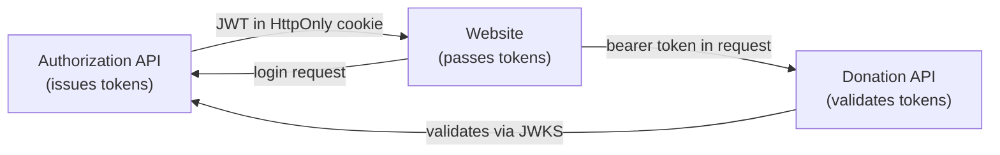

# Authorization and Roles

Status: Target

This document defines the role model and permission boundaries for the TimeForCode platform.

---

## Roles

The platform defines four roles. A user may hold more than one role (e.g. a developer can be both a Maintainer and a Contributor).

| Role | Description |
| --- | --- |
| `Admin` | Platform operator. Can approve projects, manage organizations, and moderate content. |
| `Maintainer` | Owns and manages one or more registered open-source projects. |
| `DonorOrganizationMember` | Member of a registered donor organization. Can make or manage donations on behalf of the organization. |
| `Contributor` | A developer who logs hours against active donations. |

Anonymous users (not authenticated) can only read public project listings.

---

## Role Assignment

Roles are stored as claims inside the internal JWT issued by the Authorization API. They are not delegated from GitHub.

| Role | How assigned |
| --- | --- |
| `Admin` | Manually assigned by an existing admin; cannot be self-assigned |
| `Maintainer` | Granted when a user registers a project for the first time |
| `DonorOrganizationMember` | Granted when a user is added to an organization by an existing org member or admin |
| `Contributor` | Self-service; any authenticated user can become a contributor |

---

## Permissions

The table below defines which roles are authorised for each operation. A checkmark means the role is permitted. An empty cell means the operation is not permitted for that role.

### Project Operations

| Operation | Anonymous | Contributor | Maintainer | DonorOrgMember | Admin |
| --- | --- | --- | --- | --- | --- |
| View active project listings | ✅ | ✅ | ✅ | ✅ | ✅ |
| Submit a project for registration | | | ✅ | | ✅ |
| Edit own project details | | | ✅ (own) | | ✅ |
| Approve / reject project | | | | | ✅ |
| Archive a project | | | ✅ (own) | | ✅ |

### Donation Operations

| Operation | Contributor | Maintainer | DonorOrgMember | Admin |
| --- | --- | --- | --- | --- |
| Pledge hours (organization) | | | ✅ | ✅ |
| Pledge hours (individual) | ✅ | ✅ | ✅ | ✅ |
| View own donations | ✅ | | ✅ | ✅ |
| Cancel pending donation | | | ✅ (own) | ✅ |
| Activate a donation | | | ✅ (own) | ✅ |
| View all donations (admin) | | | | ✅ |

### Hour Tracking Operations

| Operation | Contributor | DonorOrgMember | Admin |
| --- | --- | --- | --- |
| Log hours against active donation | ✅ (assigned) | ✅ (assigned) | ✅ |
| View own hour logs | ✅ | ✅ | ✅ |
| Edit own hour logs (within 24h) | ✅ | ✅ | ✅ |
| Delete any hour log | | | ✅ |

### Organization Operations

| Operation | Contributor | DonorOrgMember | Admin |
| --- | --- | --- | --- |
| Register new organization | ✅ | | ✅ |
| View own organization | | ✅ | ✅ |
| Edit own organization | | ✅ (owner) | ✅ |
| Add / remove members | | ✅ (owner) | ✅ |
| View any organization | | | ✅ |

### Reporting

| Operation | Contributor | Maintainer | DonorOrgMember | Admin |
| --- | --- | --- | --- | --- |
| View own contribution history | ✅ | | ✅ | ✅ |
| View project donation report | | ✅ (own) | | ✅ |
| View organization impact report | | | ✅ (own) | ✅ |
| View platform-wide stats | | | | ✅ |

---

## Authorization Implementation

Roles are embedded as claims in the internal JWT:

```json
{
  "sub": "user-uuid",
  "roles": ["Contributor", "Maintainer"],
  "iss": "https://timeforcode-auth-api.azurewebsites.net",
  "aud": "https://timeforcode-website.azurewebsites.net",
  "exp": 1234567890
}
```

Backend APIs enforce authorization using ASP.NET Core policy-based authorization. Each endpoint declares the required role(s) via an `[Authorize(Policy = "...")]` attribute. Policies are defined in `Startup.cs` of each API.

Resource-level ownership checks (e.g. "edit own project only") are enforced in the application layer, not the API layer.

---

## Security Boundary

The Authorization API is the only service that issues tokens. All other services (Donation API, Website backend) validate tokens but never issue them. This keeps the trust boundary narrow and the signing key confined to a single service.


