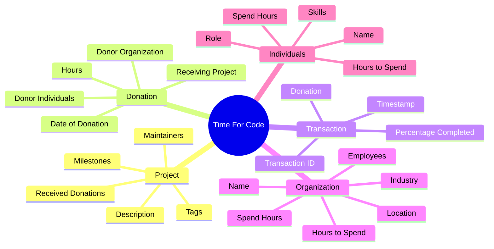
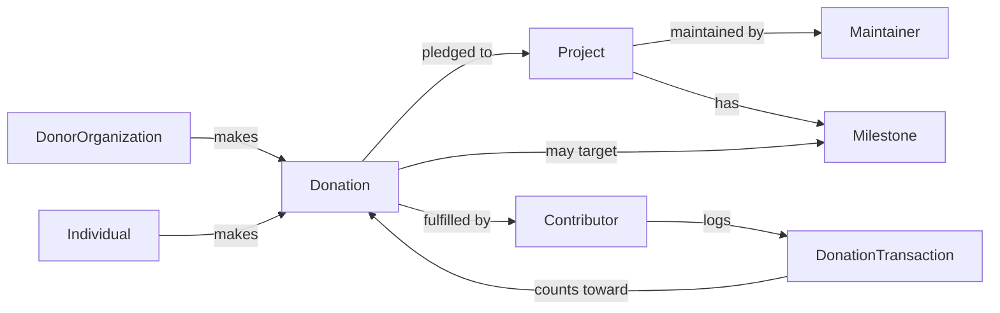
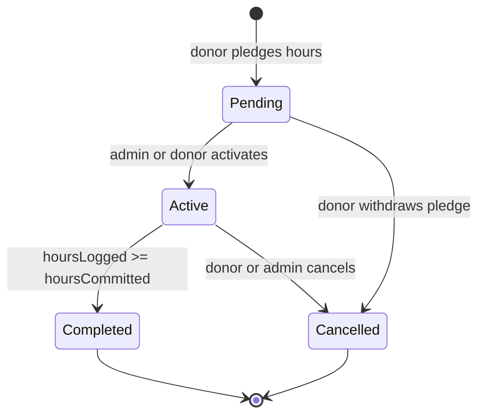
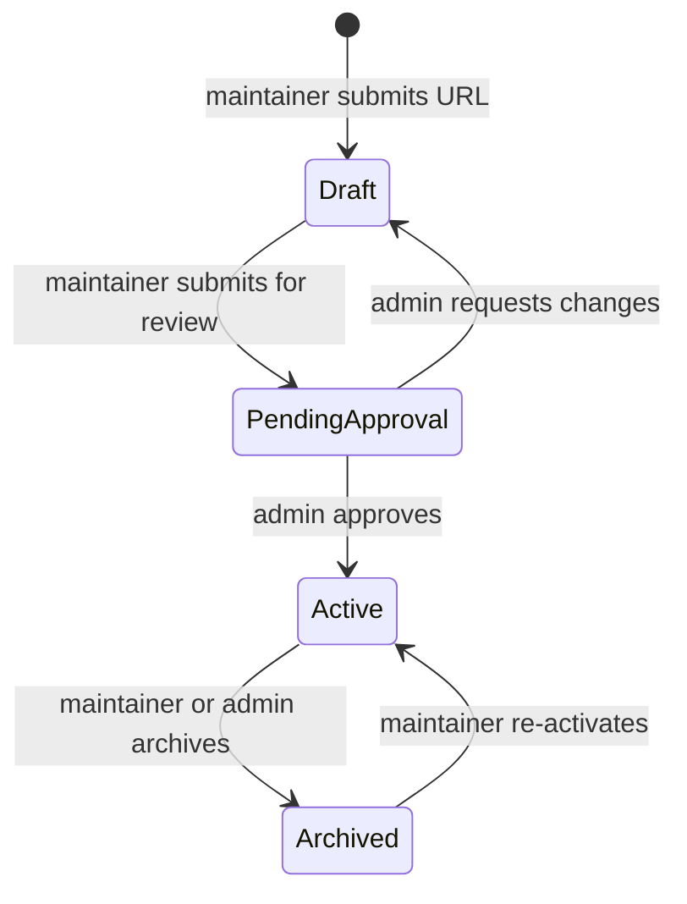

# Target Domain Model

Status: Target

This document describes the domain model that the TimeForCode platform should implement. It builds on the existing domain entities in code and extends them to cover the full target platform behaviour.

---

## Overview

The platform revolves around three core concepts: **Projects** that need help, **Donations** of developer hours to those projects, and **Organizations or Individuals** that make those donations.

The mind map below shows the domain entities and their key attributes at a glance. The relationship diagram that follows it shows how they connect.

---

## Entities

### Project

A registered open-source software project that is seeking donated developer hours.

| Attribute | Type | Description |
|---|---|---|
| id | UUID | Internal identifier |
| githubUrl | URL | GitHub repository URL |
| name | string | Repository name (synced from GitHub) |
| description | string | Short description (synced from GitHub) |
| language | string | Primary programming language (synced from GitHub) |
| tags | string[] | Searchable tags added by the maintainer |
| status | enum | Draft, PendingApproval, Active, Archived |
| maintainerId | UUID | Reference to the Maintainer |
| milestones | Milestone[] | GitHub-linked milestones |
| receivedDonations | Donation[] | All donations pledged to this project |

A project starts as a `Draft` when submitted, becomes `PendingApproval` when submitted for review, `Active` once an administrator approves it, and `Archived` when the project is no longer accepting contributions.

### Donation

A pledge of a specific number of developer hours from a donor to a project.

| Attribute | Type | Description |
|---|---|---|
| id | UUID | Internal identifier |
| donorOrganizationId | UUID? | Linked organization (null for individual donations) |
| individualDonorId | UUID? | Linked individual donor (null for organization donations) |
| projectId | UUID | Target project |
| hoursCommitted | decimal | Total hours pledged |
| hoursLogged | decimal | Hours logged so far via transactions |
| status | enum | Pending, Active, Completed, Cancelled |
| createdAt | DateTime | When the pledge was made |
| completedAt | DateTime? | When all hours were logged |

The donation lifecycle is: `Pending` (pledge made, awaiting start) → `Active` (contributors are logging hours) → `Completed` (all hours logged) or `Cancelled` (withdrawn before completion).

### DonationTransaction

A single record of hours logged by a contributor against an active donation.

| Attribute | Type | Description |
|---|---|---|
| id | UUID | Internal identifier |
| donationId | UUID | The donation this transaction belongs to |
| contributorId | UUID | The contributor who logged the hours |
| hours | decimal | Hours logged in this entry |
| description | string | What was done |
| githubReference | URL? | Link to a commit or pull request (optional) |
| loggedAt | DateTime | Timestamp |

### DonorOrganization

A company or organisation registered as a donor.

| Attribute | Type | Description |
|---|---|---|
| id | UUID | Internal identifier |
| name | string | Organisation name |
| industry | string | Industry sector |
| country | string | Country |
| hoursAvailable | decimal | Total hours the organisation has committed to donate |
| hoursSpent | decimal | Total hours logged across all their donations |
| employees | Contributor[] | Contributors affiliated with this organisation |
| donations | Donation[] | All donations made by this organisation |

### Contributor

A developer who logs hours against a donation. Can belong to an organisation or be independent.

| Attribute | Type | Description |
|---|---|---|
| id | UUID | Internal identifier |
| userId | UUID | Linked user account |
| name | string | Display name |
| githubUsername | string | GitHub username |
| role | string | Job role or title |
| skills | string[] | Self-declared skills and technologies |
| organizationId | UUID? | Affiliated donor organisation (null for independents) |
| hoursAvailable | decimal | Hours available to donate per period |
| hoursSpent | decimal | Total hours logged |

### Maintainer

A developer who owns or maintains a registered project.

| Attribute | Type | Description |
|---|---|---|
| id | UUID | Internal identifier |
| userId | UUID | Linked user account |
| name | string | Display name |
| githubUsername | string | GitHub username |
| projects | Project[] | Projects maintained by this person |

### Milestone

A phase or goal within a project that a donation may target.

| Attribute | Type | Description |
|---|---|---|
| id | UUID | Internal identifier |
| projectId | UUID | Parent project |
| githubMilestoneId | int | GitHub milestone number |
| title | string | Milestone title (synced from GitHub) |
| description | string | Milestone description |
| state | enum | Open, Closed |
| dueDate | DateTime? | Optional due date |

---

## Lifecycle States

### Donation State Machine

### Project State Machine

---

## Domain Rules

- A donation must target exactly one project.
- A donation is made by either one organisation or one individual — not both.
- A contributor must be linked to either an organisation donation or be an individual donor.
- Hours logged across all transactions for a donation cannot exceed `hoursCommitted` without an explicit override.
- A project can only receive donations when its status is `Active`.
- Organisations track `hoursSpent` as the sum of all `DonationTransaction.hours` for all their donations.
