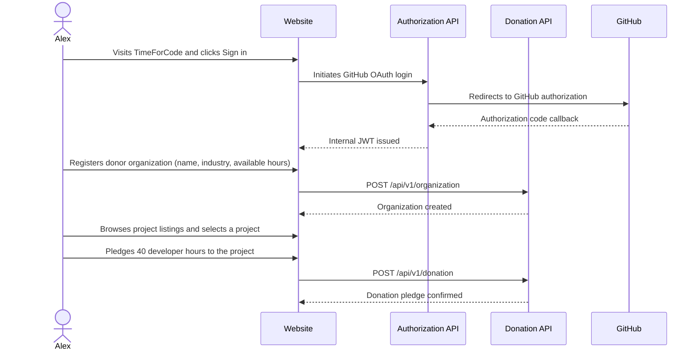
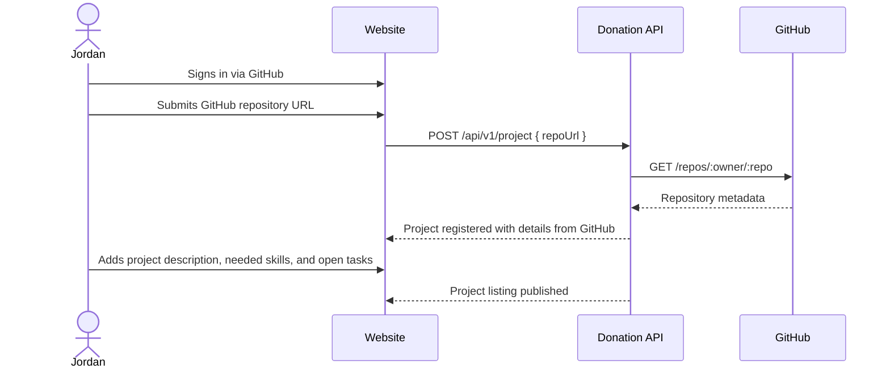
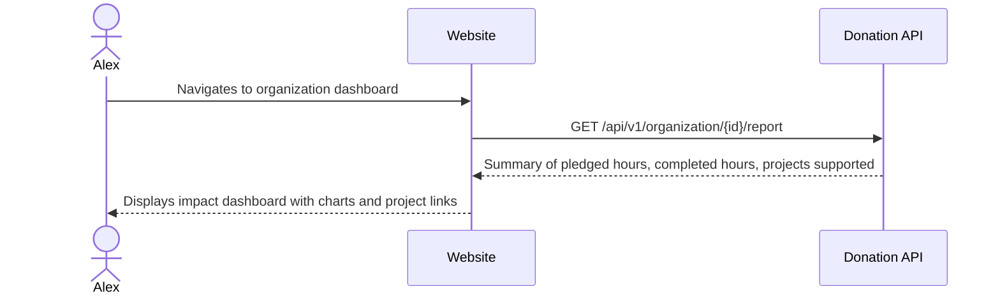

# Personas and Journeys

Status: Target

This document describes the key actors in the TimeForCode platform and their primary end-to-end journeys. These journeys define the critical paths that the platform must support.

---

## Personas

### Alex — Engineering Manager at a Software Company

Alex leads a team of 12 developers. The company wants to invest in open source as part of its corporate responsibility programme. Alex needs a way to register the company, define a pool of donated hours, and track how those hours are used.

**Motivations**: corporate visibility, developer satisfaction, community goodwill.
**Pain points**: no structured way to coordinate contributions, no verifiable record for reporting.

### Sasha — Individual Developer

Sasha is a backend developer who wants to contribute to open-source projects outside of working hours. Sasha wants to find projects that match their skills and commit a fixed number of hours per month.

**Motivations**: personal growth, portfolio building, giving back.
**Pain points**: hard to find projects that match skills and availability.

### Jordan — Open Source Project Maintainer

Jordan maintains a popular infrastructure library used by thousands of companies. The project needs help with documentation, testing, and new features. Jordan wants to attract structured contributions rather than ad-hoc pull requests.

**Motivations**: sustainable maintenance, community growth.
**Pain points**: burned out from solo maintenance, hard to coordinate contributors.

### Robin — Platform Administrator

Robin manages the TimeForCode platform. Robin needs to review project submissions, verify organizations, and handle abuse or moderation issues.

**Motivations**: platform quality, trust, and reliability.
**Pain points**: manual review overhead, no tooling for moderation.

---

## Key Journeys

### Journey 1 — Company Registers and Pledges Hours



This is the primary donor journey. The company authenticates via GitHub, registers their organization and available hours, finds a project, and commits a donation.

### Journey 2 — Project Maintainer Registers a Project



The project maintainer submits a GitHub repository URL. The platform fetches metadata (name, description, language, open issues) from the GitHub API and creates the project listing automatically.

### Journey 3 — Contributor Logs Time Against a Donation

```mermaid
sequenceDiagram
    actor Sasha
    participant Website
    participant DonationAPI as Donation API

    Sasha->>Website: Views available projects and finds a match
    Sasha->>Website: Applies to contribute to project X (under organization donation)
    Website->>DonationAPI: POST /api/v1/donation/{id}/contributor
    DonationAPI-->>Website: Contributor assigned; hours allocated
    Sasha->>Website: Logs hours after completing work
    Website->>DonationAPI: POST /api/v1/donation/{id}/transaction { hours, description }
    DonationAPI-->>Website: Hours recorded; donation progress updated
```

Once a donation is active, contributors log time transactions against it. The platform accumulates hours and tracks progress toward the pledged total.

### Journey 4 — Administrator Reviews and Approves a Project

```mermaid
sequenceDiagram
    actor Robin
    participant Website
    participant DonationAPI as Donation API

    DonationAPI-->>Robin: Notification: new project submitted
    Robin->>Website: Opens admin review queue
    Robin->>Website: Reviews project details
    Robin->>Website: Approves or rejects project
    Website->>DonationAPI: PATCH /api/v1/project/{id}/status { status: approved }
    DonationAPI-->>Website: Project status updated; visible in listings
```

New projects require admin approval before they appear in the public listing. This prevents spam and ensures quality.

### Journey 5 — Donor Views Impact Report



Organizations can view a report of their contributions: total hours pledged, completed, and which projects benefited.
