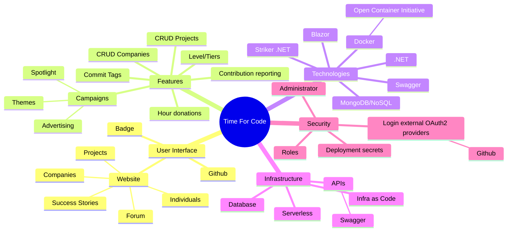

# Product Vision

Status: Target

This document describes what TimeForCode is, who it is for, and what problem it solves. It is the anchor for all requirements, design decisions, and implementation work.

---

## Mission

TimeForCode makes it easy for companies and individuals to donate developer time to open-source projects in a structured, measurable, and transparent way.

Open source powers most of the software in the world, yet the developers who maintain those projects rarely receive the sustained support they need. Companies benefit enormously from open-source software but often lack a simple, accountable way to contribute back. TimeForCode bridges that gap.

---

## The Problem

- Open-source project maintainers are often overwhelmed and under-resourced.
- Companies want to contribute to open source but struggle with accountability, visibility, and coordination.
- Individual contributors want to apply their professional skills to meaningful projects but lack a structured channel.
- There is no standard way to match available developer time with the projects that need it most.

---

## The Solution

TimeForCode provides:

1. **A project registry** — open-source projects can list themselves and describe what kind of help they need.
2. **Donation pledges** — companies and individuals pledge developer hours to specific projects.
3. **Matchmaking** — the platform suggests matches between available hours and project needs based on skills, technology, and project goals.
4. **Time tracking** — contributors log hours against a donation; the platform tracks progress toward the pledged commitment.
5. **Impact reporting** — donors and projects get transparent, verifiable records of contributions made.
6. **Recognition** — companies earn badges and recognition for their open-source investment.

---

## User Segments

### Donor Organizations

Companies that want to give back to open source by allocating developer hours. They register on the platform, define a pool of hours and employees, and choose projects to support.

**Goals**: demonstrate social responsibility, improve developer skills, build reputation in the open-source community.

### Individual Donors

Individual developers who pledge their personal time to open-source projects, independently of any company.

**Goals**: contribute to meaningful work, build a visible open-source track record.

### Project Maintainers

Developers or teams who maintain open-source projects and register on the platform to attract structured contributions.

**Goals**: find reliable contributors, reduce the burden of maintaining underfunded projects.

### Platform Administrators

Internal operators responsible for moderating project listings, verifying organizations, and maintaining platform health.

**Goals**: keep the platform trustworthy and free of spam or abuse.

---

## Value Proposition

| Stakeholder | Value |
|---|---|
| Donor organizations | Structured, accountable, and visible open-source contribution |
| Individual donors | A platform that connects personal skills to real-world impact |
| Project maintainers | Reliable contributors with predictable commitment levels |
| Open-source ecosystem | Sustained, distributed support for critical infrastructure |

---

## Non-Goals

The platform is **not**:

- A job board or recruitment platform.
- A freelance marketplace (contributions are donations, not paid engagements).
- A general-purpose project management tool.
- A replacement for GitHub Issues, Pull Requests, or Discussions.

---

## Success Metrics

| Metric | Description |
|---|---|
| Registered projects | Number of open-source projects listed on the platform |
| Active donors | Number of organizations and individuals with active pledges |
| Hours pledged | Total developer hours committed per period |
| Hours completed | Total hours actually logged and completed |
| Match rate | Percentage of pledged hours successfully matched to a project |
| Retention rate | Donors who make repeat pledges |

---

## Platform at a Glance

The following mind map gives a high-level orientation to the platform's features, technologies, and infrastructure areas.

